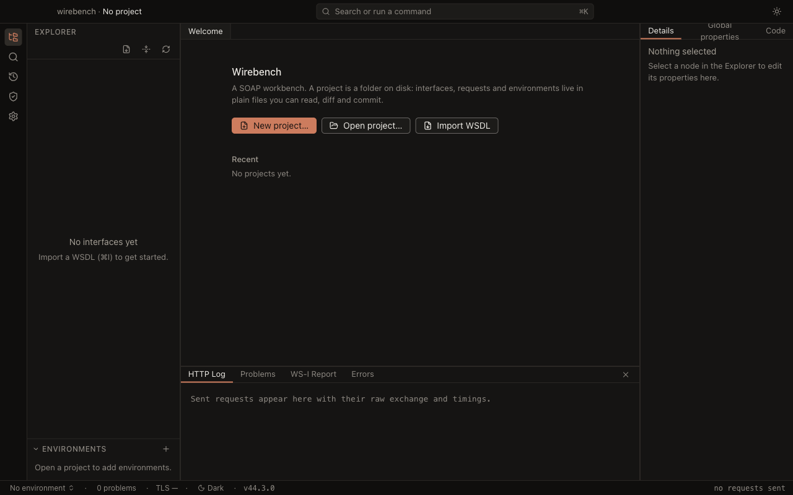

# Wirebench

Wirebench is an open-source desktop SOAP/WSDL workbench with a modern IDE shell, built on Electron, TypeScript and
React. Import a WSDL, get a request generated from the contract, send it, and read the response — with WS-Security,
WS-Addressing, MTOM/SwA attachments, schema and WS-I validation, environments, property expansion and searchable
history along the way. REST support is planned for a later phase; the engine and project format are already
protocol-neutral.

Projects are folders of small YAML and XML files, made to live in git. Credentials never go in them.


## Quick start

Five minutes from nothing to a real SOAP response. You need [Node 24](https://nodejs.org) and pnpm 9
(`corepack enable`).

```
git clone <this repository>
cd wirebench
pnpm install
pnpm dev
```

**1. Create a project.** On the Welcome screen, choose **New project** and pick a folder. That folder _is_ the
project — everything Wirebench saves goes there, in reviewable text files.

**2. Import a WSDL.** Choose **Import WSDL…** (`Mod+I`) and paste a URL or pick a file. Anything the document imports
or includes is fetched with it and cached beside the project, byte for byte.


Try one of these public services if you do not have one to hand:

- `http://www.dneonline.com/calculator.asmx?WSDL`
- `https://www.dataaccess.com/webservicesserver/NumberConversion.wso?WSDL`
- `http://webservices.oorsprong.org/websamples.countryinfo/CountryInfoService.wso?WSDL`

**3. Open a request.** The explorer fills with the service's bindings and operations, each with a `Request 1` whose
envelope was generated from the schema — the right elements, in the right order, in the right namespaces.


**4. Fill in the values and send.** Replace the `?` placeholders (or switch to the **Form** tab and type into fields),
then press **Send**. The response arrives beside the request with its status, duration, size, headers and raw bytes;
the HTTP Log at the bottom shows the timing breakdown, and the run is in History for re-sending or diffing later.

That is the whole loop. From here: **Query** evaluates XPath 3.1 and XQuery 3.1 over the response, the details panel
carries auth, WS-Security, WS-Addressing and attachments, `Mod+K` opens the command palette, and the Environments
section switches endpoints without touching a request.



## Keyboard shortcuts

Every action in Wirebench is a command with an id, and every shortcut is that command's binding — the command palette
(`⌘K` / `Ctrl+K`) lists them all. `Mod` is `⌘` on macOS and `Ctrl` elsewhere.

| Command                 | Shortcut      |
| ----------------------- | ------------- |
| Show All Commands       | `Mod+K`       |
| Toggle Sidebar          | `Mod+B`       |
| Toggle Console          | `Mod+J`       |
| Toggle Details Panel    | `Mod+Alt+B`   |
| Show Explorer           | `Mod+Shift+E` |
| Show Search             | `Mod+Shift+S` |
| Show History            | `Mod+Shift+Y` |
| Show Settings           | `Mod+,`       |
| Import WSDL…            | `Mod+I`       |
| Open Project…           | `Mod+O`       |
| New Project             | `Mod+Shift+N` |
| Toggle Light/Dark Theme | —             |

`Mod+Shift+F` is deliberately unassigned here: it is reserved for Format XML.

## Development

```
pnpm install                       # bootstrap workspace (Node 24, pnpm 9)
pnpm dev                           # electron-vite dev: main/preload/renderer with HMR
pnpm build                         # pnpm typecheck && electron-vite build (all workspaces)
pnpm package                       # electron-builder --dir (unpacked app for the current OS)
pnpm package:mac | package:win | package:linux
pnpm test                          # vitest run
pnpm lint                          # eslint . --max-warnings 0 && prettier --check .
pnpm typecheck                     # tsc -b
pnpm check                         # lint + typecheck + test ← the pre-commit and CI gate
pnpm test:e2e                      # Playwright against the built Electron app
pnpm test:interop                  # live public SOAP services (opt-in; see below)
pnpm bench                         # vitest benchmarks over the engine's budgeted scenarios
```

See [CONTRIBUTING.md](CONTRIBUTING.md) for the full workflow.

### Performance budgets

`pnpm check` includes the engine's performance gate (`packages/engine/test/perf/budgets.test.ts`), and `pnpm test:e2e`
includes the app's (`e2e/specs/perf.spec.ts`). Both take the median of several samples and allow generous headroom, so
they catch a real regression rather than a busy machine — but on a slow or heavily loaded one they can still be noise.
Set `WIREBENCH_SKIP_PERF=1` to skip both:

```
WIREBENCH_SKIP_PERF=1 pnpm check
```

`pnpm bench` reports the same scenarios as trend numbers instead of pass/fail. The budgets themselves live in one map,
`packages/engine/test/bench/budgets.ts`.

### Interop against live services

Every test in the repo is hermetic except one project. `pnpm test:interop` imports four public WSDLs over the real
network and makes one read-only call against each — the part a committed fixture cannot prove. It is gated behind
`WIREBENCH_NETWORK_TESTS=1` and runs on a schedule in
[`nightly.yml`](.github/workflows/nightly.yml), never on a pull request: somebody else's outage must not turn a PR red.

### Screenshots in this README

They are produced by a spec, not by hand:

```
pnpm build && WIREBENCH_SCREENSHOTS=1 pnpm test:e2e -- screenshots.spec.ts
```

`e2e/specs/screenshots.spec.ts` writes `docs/images/*.png` from the fixture project in dark theme at 1280×800, and
skips itself otherwise.

## Packaging

`pnpm package` (or `package:mac` / `package:win` / `package:linux`) builds an installable app into
`apps/desktop/release/`. Releases are cut by pushing a `v*` tag; see [`docs/release.md`](docs/release.md) for the
signing secrets, the Electron fuse table and how the opt-in update check behaves.

The `repository` URL in `apps/desktop/package.json` is still the placeholder
`https://github.com/wirebench/wirebench.git`. It is what the update feed is derived from, so it has to be corrected to
the real repository before the first release.

## Documentation

- [Architecture overview](docs/architecture/overview.md) — the renderer/main/engine split, and one send end to end
- [Security model](docs/security.md) — the sandbox, secrets, path safety, TLS, fuses and the test hooks
- [Architecture decision records](docs/adr/) — ADR-0001 to ADR-0005
- [Success criteria and their evidence](docs/success-criteria.md) — every v1 criterion, and what proves it
- [Release checklist](docs/release.md)
- [Roadmap follow-ups](docs/roadmap.md) — noticed while building v1, deliberately out of scope for it
- [WS-I assertions implemented](docs/ws-i-assertions.md)
- [Design spec](docs/specs/2026-09-09-wirebench-v1-explore-and-send-design.md) and
  [implementation plan](docs/plans/2026-09-09-wirebench-v1-explore-and-send-plan.md)
- [Changelog](CHANGELOG.md)

## License

[Apache-2.0](LICENSE). Wirebench is a clean-room implementation built from public specifications and published,
user-facing documentation; no code from other SOAP tools is copied into it.

The packages Wirebench ships with are listed, with their licenses and notices, in
[THIRD-PARTY-LICENSES.md](THIRD-PARTY-LICENSES.md) — generated by `pnpm licenses:third-party`, verified by `pnpm check`,
and copied into every installer's resources.
