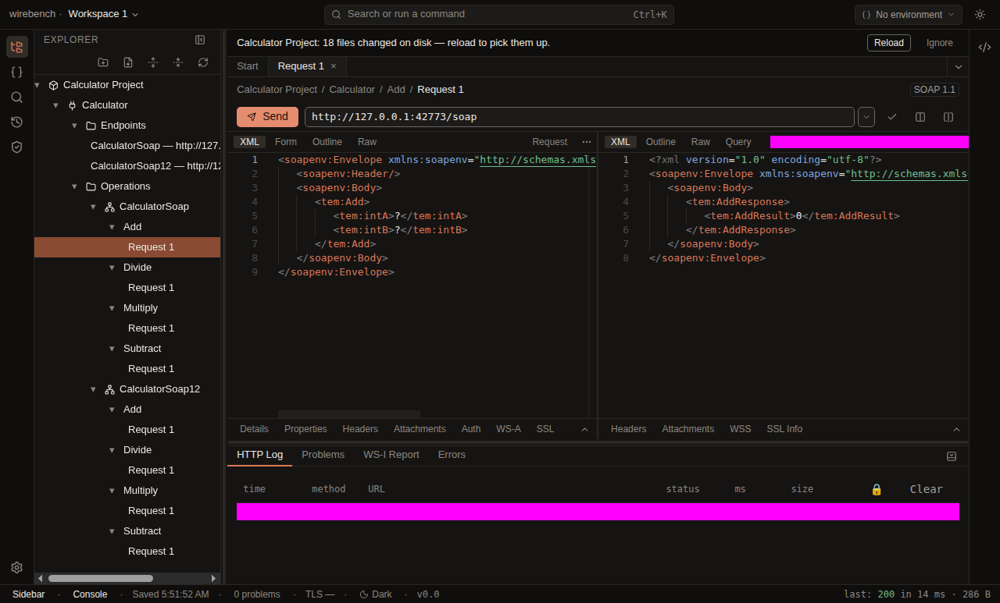
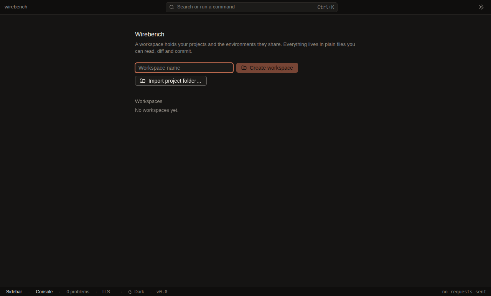
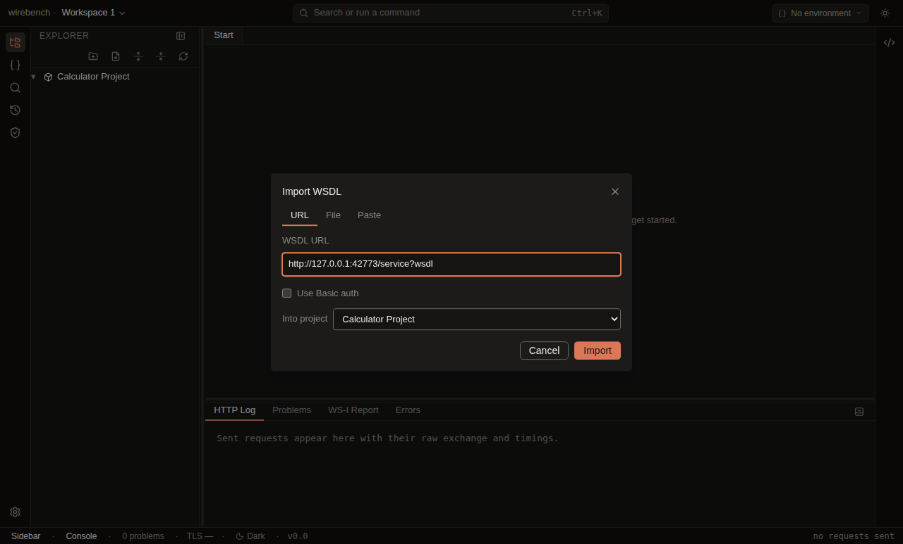
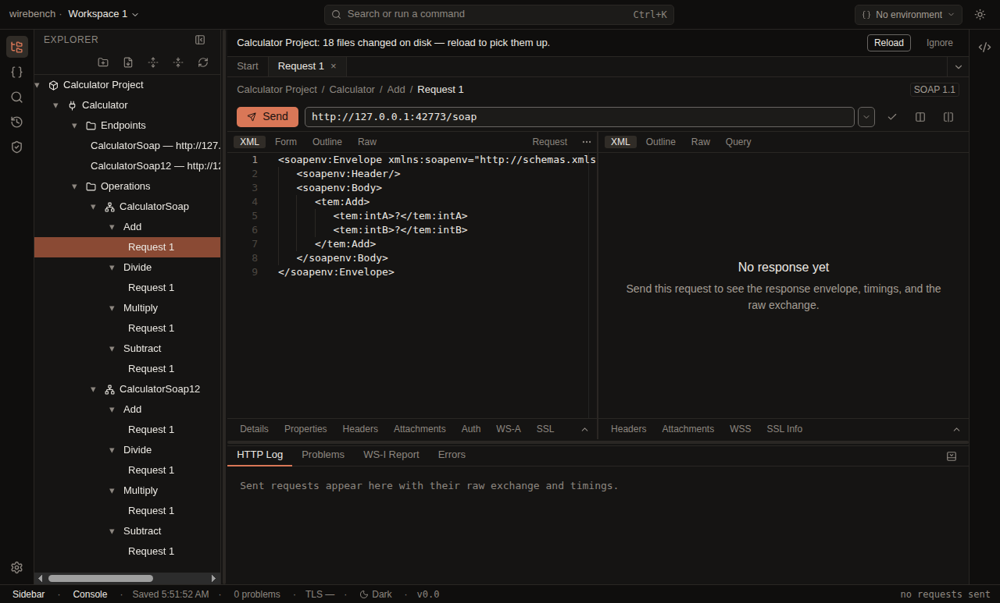
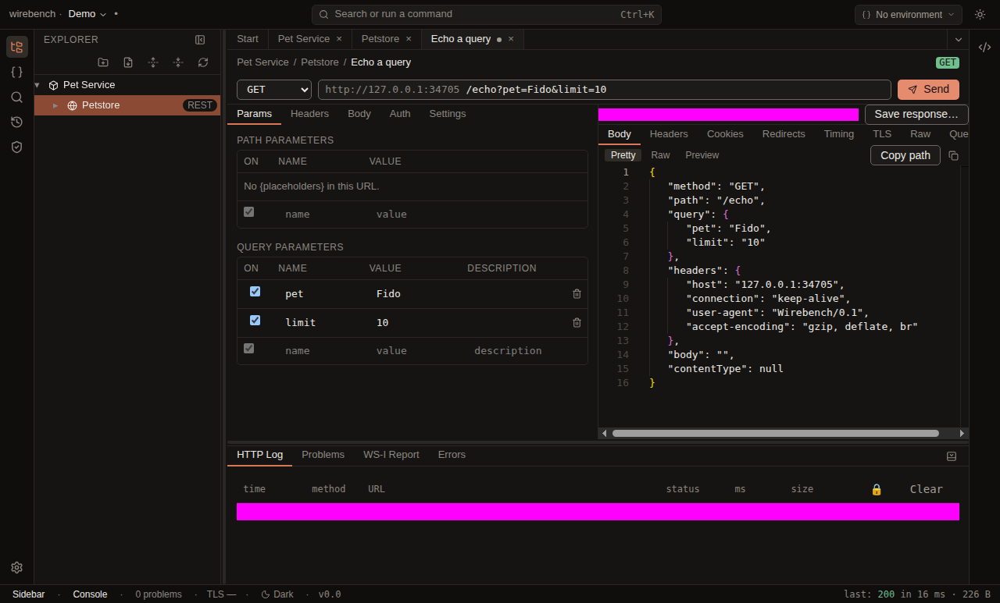

# Wirebench

Wirebench is an open-source desktop **SOAP and REST** workbench with a modern IDE shell, built on Electron,
TypeScript and React. Import a WSDL, get a request generated from the contract, send it, and read the response — with
WS-Security, WS-Addressing, MTOM/SwA attachments, schema and WS-I validation, environments, property expansion and
searchable history along the way. Or import an OpenAPI document (or start from a URL and a method) and get the same
shell for REST: folders of requests, every body kind, Basic/NTLM/Bearer/API-key/OAuth2 auth, cookies, redirects and a
response pane with pretty, raw, headers, timing and TLS. Both protocols share one project, one set of environments,
one history and one HTTP stack; gRPC is the next one to slot in.

Projects are folders of small YAML and XML files, made to live in git. Credentials never go in them.



## Quick start

Five minutes from nothing to a real SOAP response. You need [Node 24](https://nodejs.org) and pnpm 9
(`corepack enable`).

```
git clone <this repository>
cd wirebench
pnpm install
pnpm dev
```

**1. Create a workspace.** On first launch you get the workspace picker — type a name and choose **Create
workspace**. There is no folder to pick: the workspace and everything you put in it live in app data, and you never
manage that location yourself.



**2. Add a project.** Inside the workspace, choose **New project** and give it a name. A project is still a folder of
small YAML and XML files under the hood — reviewable, made to live in git — but Wirebench places and owns it inside
the workspace; _Export project…_ and _Link existing project folder…_ are how a project meets git when you want that.

**3. Import a WSDL.** Choose **Import WSDL…** (`Mod+I`) and paste a URL or pick a file, into the project you just
created or a new one. Anything the document imports or includes is fetched with it and cached beside the project,
byte for byte.



Try one of these public services if you do not have one to hand:

- `http://www.dneonline.com/calculator.asmx?WSDL`
- `https://www.dataaccess.com/webservicesserver/NumberConversion.wso?WSDL`
- `http://webservices.oorsprong.org/websamples.countryinfo/CountryInfoService.wso?WSDL`

**4. Open a request.** The explorer fills with the service's bindings and operations, each with a `Request 1` whose
envelope was generated from the schema — the right elements, in the right order, in the right namespaces.



**5. Fill in the values and send.** Replace the `?` placeholders (or switch to the **Form** tab and type into fields),
then press **Send**. The response arrives beside the request with its status, duration, size, headers and raw bytes;
the HTTP Log at the bottom shows the timing breakdown, and the run is in History for re-sending or diffing later.

**6. Or do the same for a REST API.** Choose **Import OpenAPI…** (`Mod+Shift+I`) and paste a URL or pick a file —
the explorer fills with folders and requests, each with its parameters and a body sampled from the schema. There is no
document needed either: **New API** takes a name and a base URL, and **New Request** takes a method and a path. Send
is the same button, and the send lands in the same History, badged with its method.



That is the whole loop. From here: a workspace holds any number of projects, with tabs spanning all of them; **Query**
evaluates XPath 3.1 and XQuery 3.1 over the response, plus JSONPath when the body is JSON; the request editor's
inspector strip carries _Details_,
_Properties_, _Headers_, _Attachments_, _Auth_, _WS-A_ and _SSL_, one inspector each; `Mod+K` opens the command
palette; and **Environments**, reached from the
activity bar, is workspace-wide — one set of environments and endpoint overrides shared by every project, switched
without touching a request, with a per-variable checkbox to disable a value without deleting it.

## Keyboard shortcuts

Every action in Wirebench is a command with an id, and every shortcut is that command's binding — the command palette
(`⌘K` / `Ctrl+K`) lists them all. `Mod` is `⌘` on macOS and `Ctrl` elsewhere.

| Command                 | Shortcut      |
| ----------------------- | ------------- |
| Show All Commands       | `Mod+K`       |
| Toggle Sidebar          | `Mod+B`       |
| Toggle Console          | `Mod+J`       |
| Toggle Code Panel       | `Mod+Alt+B`   |
| Show Explorer           | `Mod+Shift+E` |
| Show Search             | `Mod+Shift+S` |
| Show History            | `Mod+Shift+Y` |
| Show Settings           | `Mod+,`       |
| Import WSDL…            | `Mod+I`       |
| Import OpenAPI…         | `Mod+Shift+I` |
| New Project             | `Mod+Shift+N` |
| Save All                | `Mod+S`       |
| Next Environment        | `Mod+Alt+E`   |
| Toggle Light/Dark Theme | —             |

`Toggle Code Panel` (`view.toggleCode`) opens and closes the right-rail slide-over that shows the current request as
`curl`; the old Details-panel toggle it replaces is gone (there is no right panel any more — see
[Architecture overview](docs/architecture/overview.md)). `Show Environments` (`view.showEnvironments`) opens the
Environments view in the sidebar; it has no default shortcut of its own, only the command-palette entry.

Workspace management (create, switch, manage, link/import/export a project) is reachable from the command palette and
the workspace switcher; it has no default keyboard shortcuts of its own.

`Mod+Shift+F` is deliberately unassigned here: it is reserved for Format XML.

## Development

```
pnpm install                       # bootstrap workspace (Node 24, pnpm 9)
pnpm dev                           # electron-vite dev: main/preload/renderer with HMR
pnpm build                         # pnpm typecheck && electron-vite build (all workspaces)
pnpm package                       # electron-builder --dir (unpacked app for the current OS)
pnpm package:mac | package:win | package:linux
pnpm test                          # vitest run
pnpm lint                          # eslint . --max-warnings 0 && prettier --check .
pnpm typecheck                     # tsc -b
pnpm check                         # lint + typecheck + test ← the pre-commit and CI gate
pnpm test:e2e                      # Playwright against the built Electron app
pnpm test:interop                  # live public SOAP services (opt-in; see below)
pnpm bench                         # vitest benchmarks over the engine's budgeted scenarios
```

See [CONTRIBUTING.md](CONTRIBUTING.md) for the full workflow.

### Performance budgets

`pnpm check` includes the engine's performance gate (`packages/engine/test/perf/budgets.test.ts`), and `pnpm test:e2e`
includes the app's (`e2e/specs/perf.spec.ts`). Both take the median of several samples and allow generous headroom, so
they catch a real regression rather than a busy machine — but on a slow or heavily loaded one they can still be noise.
Set `WIREBENCH_SKIP_PERF=1` to skip both:

```
WIREBENCH_SKIP_PERF=1 pnpm check
```

`pnpm bench` reports the same scenarios as trend numbers instead of pass/fail. The budgets themselves live in one map,
`packages/engine/test/bench/budgets.ts`.

### Interop against live services

Every test in the repo is hermetic except one project. `pnpm test:interop` imports four public WSDLs over the real
network and makes one read-only call against each — the part a committed fixture cannot prove. It is gated behind
`WIREBENCH_NETWORK_TESTS=1` and runs on a schedule in
[`nightly.yml`](.github/workflows/nightly.yml), never on a pull request: somebody else's outage must not turn a PR red.

### Screenshots in this README

They are produced by a spec, not by hand:

```
pnpm build && WIREBENCH_SCREENSHOTS=1 pnpm test:e2e -- screenshots.spec.ts
```

`e2e/specs/screenshots.spec.ts` writes `docs/images/*.png` from the fixture project in dark theme at 1280×800, and
skips itself otherwise.

## Packaging

`pnpm package` (or `package:mac` / `package:win` / `package:linux`) builds an installable app into
`apps/desktop/release/`. Releases are cut by pushing a `v*` tag; see [`docs/release.md`](docs/release.md) for the
signing secrets, the Electron fuse table and how the opt-in update check behaves.

The `repository` URL in `apps/desktop/package.json` is `https://github.com/wirebench/wirebench.git`, the public
repository. It is what the opt-in update feed is derived from.

## Documentation

- [Architecture overview](docs/architecture/overview.md) — the renderer/main/engine split, and one send end to end
- [Security model](docs/security.md) — the sandbox, secrets, path safety, TLS, fuses and the test hooks
- [Architecture decision records](docs/adr/) — ADR-0001 to ADR-0007
- [Success criteria and their evidence](docs/success-criteria.md) — every criterion, SOAP and REST, and what proves it
- [Release checklist](docs/release.md)
- [Roadmap](docs/roadmap.md) — what 2.0 leaves out, in the order it is worth building, and what each item unlocks
- [WS-I assertions implemented](docs/ws-i-assertions.md)
- [Design spec](docs/specs/2026-09-09-wirebench-v1-explore-and-send-design.md) and
  [implementation plan](docs/plans/2026-09-09-wirebench-v1-explore-and-send-plan.md)
- [Workspaces design spec](docs/specs/2026-09-11-wirebench-workspaces-design.md) and
  [implementation plan](docs/plans/2026-09-11-wirebench-workspaces-plan.md)
- [REST client design spec](docs/specs/2026-09-13-wirebench-rest-client-design.md) and
  [implementation plan](docs/plans/2026-09-13-wirebench-rest-client-plan.md) — APIs, folders and requests beside
  SOAP interfaces, OpenAPI import, OAuth2, and what it fixes now so gRPC can follow
- [Changelog](CHANGELOG.md)

## Roadmap

Explore-and-send works across workspaces, for SOAP and for REST. What comes next, in the order it is worth building;
the [full roadmap](docs/roadmap.md) has the reasoning, sizes, and the detail per theme.

1. **Signed and notarised releases** — managed Macs and Windows fleets block unsigned apps.
2. **Documentation site** — install and first-run pages, one guide per feature, a generated command reference.
3. **CLI runner** — `wirebench run` with assertions and JUnit output, for CI.
4. **Kerberos/SPNEGO** — Windows-integrated authentication.
5. **REST follow-ups** — resend and diff a REST send from History, a shared cookie jar, an HTML response preview,
   OpenAPI 2.0 (Swagger) import, _Update Definition_ for an API, response validation against the document, and the
   three token-style auth kinds offered to SOAP owners too.
6. **gRPC client** — a third container beside APIs and interfaces, on the shape ADR-0007 was written to survive.
7. **Mock services** — generated from a WSDL, scripted dispatch, recording from live traffic.
8. **MCP server** — the engine driven by coding agents.
9. **Teams and sign-in** — git-linked project folders shipped in 1.1; next a sync design, then a self-hosted
   server with SSO. The app stays fully usable without an account.
10. **Full functional testing** — suites, the assertion catalogue, sandboxed scripting, data-driven runs.

Deferred: load testing, WSDL coverage and refactoring, code generation, a TCP monitor.

## License

[Apache-2.0](LICENSE). Wirebench is a clean-room implementation built from public specifications and published,
user-facing documentation; no code from other SOAP tools is copied into it.

The packages Wirebench ships with are listed, with their licenses and notices, in
[THIRD-PARTY-LICENSES.md](THIRD-PARTY-LICENSES.md) — generated by `pnpm licenses:third-party`, verified by `pnpm check`,
and copied into every installer's resources.
