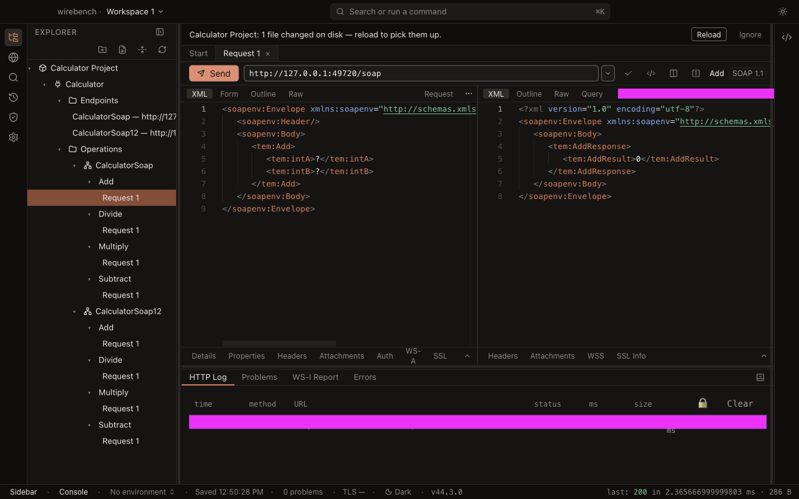
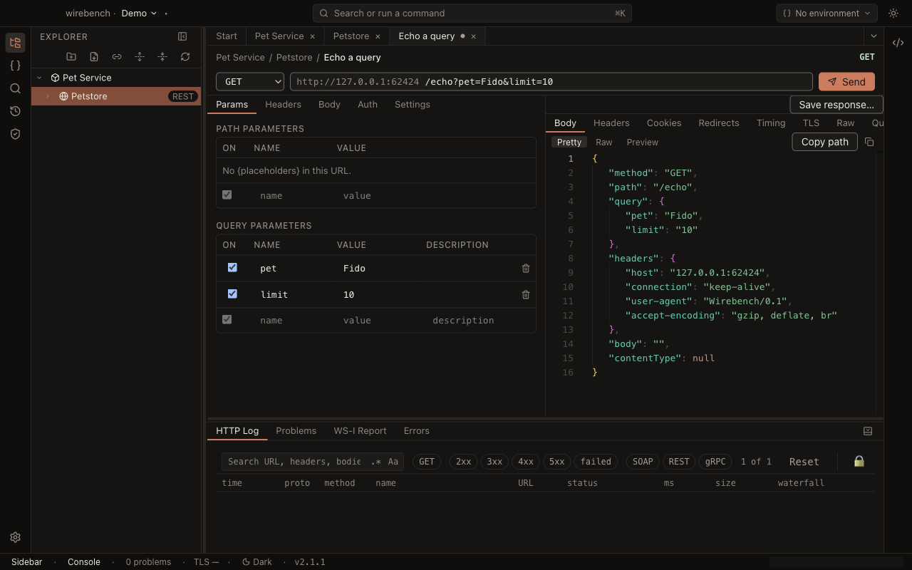
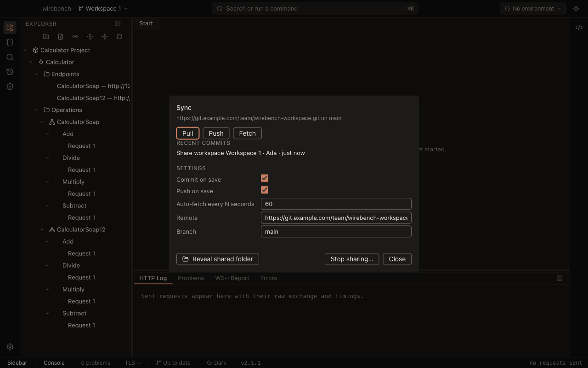

<div align="center">

# Wirebench

**A contract-first desktop workbench for SOAP, REST, gRPC and WebSocket APIs.**

Import a WSDL, OpenAPI, AsyncAPI or `.proto` contract, get correct requests generated from it, send them,
and keep everything as plain files in git.

[](https://github.com/wirebench/wirebench/actions/workflows/ci.yml)
[](https://github.com/wirebench/wirebench/releases/latest)
[](LICENSE)

[Website](https://wirebench.github.io/wirebench/) ·
[Download](https://github.com/wirebench/wirebench/releases/latest) ·
[User guide](https://wirebench.github.io/wirebench/docs/) ·
[Changelog](CHANGELOG.md)



</div>

## Why Wirebench

- **It reads the contract.** Requests are generated from the schema — the right elements, in the right order,
  in the right namespaces — and responses are validated against it.
- **One tool for a mixed estate.** SOAP, REST, gRPC and WebSocket share one project, one set of environments,
  one history and one HTTP stack.
- **Projects are files.** A project is a folder of small YAML and XML files, made to be reviewed and versioned
  in git. Credentials never go in them.
- **Local-first, no account.** The app is fully usable on its own. Teams can share over git, a synced folder,
  or a self-hosted server.
- **Built for automation.** The same saved requests run in CI from the command line, and coding agents can
  drive the engine over MCP — with no AI inside the app.

## Features

| Area                       | What you get                                                                                                                                                                                                  |
| -------------------------- | ------------------------------------------------------------------------------------------------------------------------------------------------------------------------------------------------------------- |
| **SOAP**                   | WSDL import with every import and include cached byte for byte; generated envelopes and a form editor; WS-Security, WS-Addressing, MTOM/SwA attachments; schema and WS-I validation                           |
| **REST**                   | OpenAPI 3.x, Swagger 1.x/2.0 and Postman Collection import; folders of requests; every body kind; cookies and redirects; response validation against the contract; Server-Sent Events rendered event by event |
| **gRPC**                   | `.proto` import and server reflection; unary and every streaming shape over HTTP/2, including interactive bidirectional streams; a JSON message editor with completion                                        |
| **WebSocket**              | AsyncAPI 2.x/3.0 import; a request per channel; a live frame timeline and a composer for text and binary messages                                                                                             |
| **Auth**                   | Basic, NTLM, Bearer, API key and OAuth2 across protocols; client certificates and custom CA bundles                                                                                                           |
| **Inspect**                | HTTP Log with a timing waterfall, search, compare and HAR export; XPath 3.1, XQuery 3.1 and JSONPath queries; History with re-send and diff; copy as `curl`                                                   |
| **Test**                   | Declarative assertions on every request; sequences with property transfer; sandboxed TypeScript pre-request scripts typed from the contract; snapshot regression against golden responses                     |
| **Environments & secrets** | Workspace-wide environments and endpoint overrides; `${…}` property expansion; secrets kept outside project files                                                                                             |
| **Webhooks**               | Outbound webhooks with signatures; catch URLs and callback assertions on a server-shared workspace                                                                                                            |
| **Collaboration**          | Shared workspaces over git or a synced folder, with in-app Sync and a conflict resolver; encrypted team secrets                                                                                               |
| **Migration**              | Import of legacy single-file SOAP projects — interfaces, endpoints, saved requests, properties and environments — with a report of everything not carried over                                                |

Some of the above is on `main` and arrives with the next release; the [changelog](CHANGELOG.md) says which.

<table>
  <tr>
    <td width="50%"></td>
    <td width="50%"></td>
  </tr>
  <tr>
    <td align="center"><sub>A REST request and its response</sub></td>
    <td align="center"><sub>Syncing a shared workspace</sub></td>
  </tr>
</table>

## Install

Download the installer for macOS, Windows or Linux from the
[latest release](https://github.com/wirebench/wirebench/releases/latest). macOS builds are signed and notarised;
Windows signing is in progress ([#114](https://github.com/wirebench/wirebench/issues/114)). The
[installation guide](https://wirebench.github.io/wirebench/docs/getting-started/installation/) has per-platform
notes and silent installs.

To build from source you need [Node 24](https://nodejs.org) and pnpm 9 (`corepack enable`):

```bash
git clone https://github.com/wirebench/wirebench.git
cd wirebench
pnpm install
pnpm dev
```

## Quick start

From nothing to a real SOAP response in five minutes:

1. **Create a workspace.** On first launch, type a name in the workspace picker and choose **Create workspace**.
   Wirebench keeps it in app data; there is no folder to manage.
2. **Add a project.** Choose **New project**. _Export project…_ and _Link existing project folder…_ are how a
   project meets git when you want it to.
3. **Import a contract.** **Import WSDL…** (`Mod+I`) or **Import OpenAPI…** (`Mod+Shift+I`) takes a URL or a
   file, and **Import…** detects every other format. No contract? **New API** takes a base URL and
   **New Request** a method and a path.
4. **Open a request.** The explorer fills with the operations, each with a request generated from the schema.
5. **Send.** Fill in the values — in the raw editor or the **Form** tab — and press **Send**. The response opens
   beside the request, the HTTP Log shows the timing breakdown, and the run lands in History.

No service to hand? Try `http://www.dneonline.com/calculator.asmx?WSDL`.

`Mod` is `⌘` on macOS and `Ctrl` elsewhere. Every action is a command: `Mod+K` opens the palette, and the
[command reference](https://wirebench.github.io/wirebench/docs/reference/commands/) lists every shortcut. The
[walkthrough](https://wirebench.github.io/wirebench/docs/getting-started/walkthrough/) goes further.

## Command line and CI

[`@wirebench/cli`](packages/cli) (binary `wirebench`) runs the requests saved in a project — with assertions,
exit codes, and JUnit or JSON reports — as a GitHub Action, a GitLab template, a container image or plain `npx`:

```yaml
- uses: wirebench/wirebench/action@v3.0.0
  with:
    project: ./api-tests
    env: staging
    junit: reports/wirebench.xml
  env:
    WIREBENCH_SECRET_BILLING_PASSWORD: ${{ secrets.BILLING_PASSWORD }}
```

`wirebench mcp` serves a project to a coding agent over stdio or local HTTP: import, generate, send, validate,
query and diff History, each tool also a CLI verb, with sends and writes behind explicit flags.

See [Run in CI](https://wirebench.github.io/wirebench/docs/guides/run-in-ci/),
[Agents over MCP](https://wirebench.github.io/wirebench/docs/guides/agents-mcp/) and the full
[CLI reference](docs/cli.md).

## Wirebench Server

A self-hosted server for teams: sign-in with local accounts or OpenID Connect, team roles, server-backed shared
workspaces with live updates, team secrets and webhook capture. One process, one PostgreSQL database:

```bash
docker compose -f packages/server/compose.yaml up
```

Configuration and operations are in the [server README](packages/server/README.md) and the
[server guide](https://wirebench.github.io/wirebench/docs/guides/wirebench-server/). The desktop app never
requires it.

## Documentation

| For                | Read                                                                                                                                     |
| ------------------ | ---------------------------------------------------------------------------------------------------------------------------------------- |
| Using Wirebench    | [User guide](https://wirebench.github.io/wirebench/docs/) — installation, walkthrough, a guide per feature, reference, troubleshooting   |
| Working as a team  | [Collaborate on a shared workspace](docs/collaborate.md)                                                                                 |
| Automation         | [CLI reference](docs/cli.md)                                                                                                             |
| How it is built    | [Architecture overview](docs/architecture/overview.md) · [Architecture decision records](docs/adr/) · [Security model](docs/security.md) |
| What it guarantees | [Success criteria and their evidence](docs/success-criteria.md) · [WS-I assertions implemented](docs/ws-i-assertions.md)                 |
| What comes next    | [Roadmap](docs/roadmap.md) · [Project board](https://github.com/orgs/wirebench/projects/1)                                               |
| Releasing          | [Release process](docs/release.md) — signing, Electron fuses and the opt-in update check                                                 |

The design spec and implementation plan behind each feature live in [`docs/specs`](docs/specs) and
[`docs/plans`](docs/plans).

## Roadmap

Still open, in the order it is worth building — the [full roadmap](docs/roadmap.md) has the reasoning:

- Windows code signing ([#114](https://github.com/wirebench/wirebench/issues/114))
- CLI baseline mode, and contract operations as MCP tools
- Secrets resolved from external secret managers
- Enterprise authentication: Kerberos/SPNEGO and WS-Trust
- Contract diff with a breaking-change report, runnable in CI
- WS-Security debugger and policy-driven configuration
- Mock services generated from the contract
- Test suites and data-driven runs
- GraphQL

## Development

The repository is a pnpm monorepo:

| Path                | Contents                                                            |
| ------------------- | ------------------------------------------------------------------- |
| `packages/engine`   | `@wirebench/engine` — the protocol library, one module per protocol |
| `packages/cli`      | `@wirebench/cli` — the `wirebench` binary and its MCP server        |
| `packages/server`   | Wirebench Server                                                    |
| `apps/desktop`      | The Electron app                                                    |
| `action`            | The GitHub Action                                                   |
| `e2e`               | Playwright against the built app                                    |
| `site`, `docs-site` | The website and the user guide                                      |

```bash
pnpm dev          # the desktop app with hot reload
pnpm check        # lint, typecheck and tests: the pre-commit and CI gate
pnpm build        # every package and app
pnpm test:e2e     # Playwright against the built app (build first)
pnpm package      # an installable app in apps/desktop/release/
```

[CONTRIBUTING.md](CONTRIBUTING.md) covers the full workflow: the gate, testing conventions, performance budgets,
live interop tests, screenshots, and adding a protocol.

## Contributing and security

Issues and pull requests are welcome; read [CONTRIBUTING.md](CONTRIBUTING.md) first. To report a vulnerability,
follow the reporting note in the [security model](docs/security.md) rather than opening a public issue.

## License

[Apache-2.0](LICENSE), every line in the repository. Wirebench is a clean-room implementation built from public
specifications and published, user-facing documentation; no code from other SOAP tools is copied into it.

Bundled third-party packages and their notices are listed in [THIRD-PARTY-LICENSES.md](THIRD-PARTY-LICENSES.md),
generated by `pnpm licenses:third-party`, verified by `pnpm check`, and shipped in every installer.
