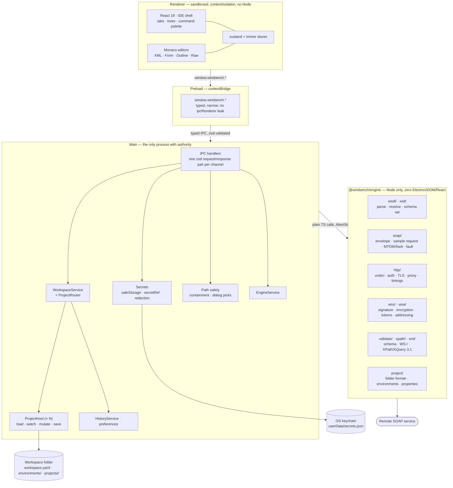

# Architecture overview

Wirebench is an Electron app in three parts: a sandboxed React renderer that draws the IDE
shell, a main process that owns every side effect, and `@wirebench/engine` — a plain Node
library that knows SOAP, WSDL, XSD and HTTP, and knows nothing about Electron.

The rule that shapes everything else: **the renderer has no network, no filesystem and no
secrets.** It asks; main decides and acts.

## The three layers

**Renderer.** React 19, zustand stores per feature, Monaco for every text surface, Radix
primitives and Tailwind v4 tokens for the shell. Every action is a *command* with an id, which
is what makes the command palette complete and the shortcut table derivable rather than
hand-maintained. The renderer holds no privileged handle: `contextIsolation: true`,
`sandbox: true`, `nodeIntegration: false`, a strict CSP, and the app's own files served over a
custom `app://` protocol.

**Preload.** One `contextBridge.exposeInMainWorld` call publishing `window.wirebench.*`.
`ipcRenderer` itself is never exposed — the renderer can call the methods that exist and
nothing else.

**Main.** Windows, menus, native dialogs, the workspace and its projects on disk, the keychain,
history, preferences — and the engine. Every channel is declared once in
`apps/desktop/src/shared/ipc.ts` with a zod schema for the request and for the response, so a
malformed message from either direction fails at the boundary with a typed error instead of
deeper in. Renderer-supplied paths are never trusted (ADR-0005); secrets never travel back out
(ADR-0004).

**The workspace layer (ADR-0006).** `WorkspaceService` (`apps/desktop/src/main/workspace-service.ts`)
owns the one open workspace: its manifest, its environments, and one `ProjectHost` per project
in it (`apps/desktop/src/main/project-host.ts` — the renamed, otherwise-unchanged v1 project
engine, now instantiated per project instead of once globally). It implements
`ProjectRouter`, the union of every `ProjectHost` method an `ipc/*.ts` module needs, re-expressed
so each call resolves its host from the entity id already on the request (`hostFor(projectId)` /
`hostOfEntity(entityId)`) — the IPC handlers do not know or care that more than one project
exists. Storage mirrors this: `<userData>/workspaces/<id>/workspace.yaml` plus
`environments/*.yaml` for the workspace, and `projects/<slug>/` per internal project (an ordinary
ADR-0003 folder); a linked project's folder lives wherever the user pointed it, addressed via an
absolute path recorded in the manifest, never sent to the renderer. Every event that used to
carry no project context now carries `projectId` — `project.changed { projectId, project }`,
`project.changedOnDisk { projectId, paths }`, `project.hydration { projectId, interfaceId,
status }` — so the renderer's stores (`state/workspace.ts`, `state/project.ts`) can keep several
projects' worth of state keyed by id and merge tabs, history and environments across them.

**The shell layout.** There is no right panel. The activity bar (far left) picks the sidebar's
view — Explorer, Search, History, Settings and **Environments** — and a fixed-width right rail
takes its place, today holding one icon (**Code**) that opens a slide-over showing the active
request as `curl`; Escape or the rail icon again closes it. What the removed panel showed lives
elsewhere: auth, WS-Security, WS-Addressing and attachments moved into the request editor's own
*Details* inspector, and a project row opens as a *project* tab instead of a side panel. Sidebar,
console and the slide-over are all collapsible and resizable — by dragging the handle, a
titlebar button, or double-clicking the handle to snap collapsed/restored — and their sizes and
collapsed state persist across a relaunch in `ui-state` (`apps/desktop/src/renderer/state/
ui-state.ts`), together with the slide-over's own POSIX/PowerShell shell preference for the Code
view (`slideOver.codeShell`). The Environments view itself (`apps/desktop/src/renderer/features/
environments/`) lists Globals, the workspace and every environment; opening one shows its
variables and endpoint overrides, each variable with an *enabled* checkbox — see "The `disabled`
list" below.

**Engine.** `packages/engine`, `@wirebench/engine`. Zero Electron, DOM or React imports —
enforced by lint, not convention. Every I/O entry point takes an `AbortSignal`, every export
carries JSDoc, every error is a `WirebenchError` subclass with a stable `code`, and every model
object is `readonly`. It is a library, not a service: the same code is meant to power the
planned `wirebench run` CLI unchanged.

## How a send actually happens

1. The user presses Send. The renderer dispatches a command and calls
   `window.wirebench.request.send(…)` with the request's project id and the request id — not an
   envelope, not an endpoint.
2. Preload forwards it over the typed channel; main validates the payload against the channel's
   zod schema, and `WorkspaceService` resolves the `projectId` to the right `ProjectHost`.
3. Main resolves what the renderer was never given: the active workspace environment's endpoint
   (falling back to the project's own environment for a linked project, then the interface's
   default — ADR-0006), property expansions across `Env → Project → Workspace → Global`,
   `secretRef`s → real credentials from `safeStorage`, keystore files (containment- or
   dialog-proven), the effective TLS and proxy settings.
4. Main calls `EngineService.send(…)` with a fully resolved request and an `AbortSignal`.
   The engine builds the envelope, applies WS-Security and WS-Addressing, prepares MTOM/SwA
   parts, and sends it through undici — capturing raw wire bytes and a timing breakdown.
5. The response comes back; main parses it, and `HistoryService` appends a redacted entry
   (stored in app data, keyed by project id — never in the project folder, and merged
   newest-first across every open project for the History view), and answers the channel.
6. The renderer renders what it was given. Cancel is the same path in reverse: one IPC call
   aborts the signal the engine is already holding.

## The `disabled` list

Every property scope — a project's own, an environment's, a workspace's, a workspace
environment's, and the global file — can disable one variable without deleting it: its value
stays in the `properties` map, but resolution skips it, so the request falls through to the next
scope down as if the value were absent. On disk this is a sibling `disabled:` list of names next
to the `properties` map (which itself stays a plain `name -> value` map), sorted, deduplicated,
and omitted entirely when it would be empty; a file with no `disabled` key migrates as "all
enabled". `enabledProperties` (`packages/engine/src/project/properties.ts`) is the one place the
filter is applied. This is an additive format change: project and workspace manifests moved to
`formatVersion: 2` and the global properties file to `version: 2` (ADR-0003, ADR-0006). A
version-1 file still loads (a missing list defaults to empty); a version-3-or-later file is
refused with the same clear error a too-new file has always produced — except the global
properties loader (`apps/desktop/src/main/global-properties.ts`), which does not check its
`version` field at all yet (tracked in `docs/roadmap.md`'s "Known limitations carried from 1.0").
A 1.0.0 build cannot open a file this build has saved: it refuses `formatVersion: 2` with its
existing "created by a newer version of Wirebench" error.

## Where things live

| Concern | Where |
|---|---|
| WSDL/XSD parsing, resolution, schema sets | `packages/engine/src/wsdl`, `packages/engine/src/xsd` |
| Envelope generation, faults, MTOM/SwA, cURL | `packages/engine/src/soap` |
| HTTP, auth (Basic/NTLMv2), TLS, proxy, timings | `packages/engine/src/http` |
| WS-Security, WS-Addressing | `packages/engine/src/wss`, `packages/engine/src/wsa` |
| Schema + WS-I validation, XPath/XQuery | `packages/engine/src/validate`, `.../xpath` |
| Project folder format, environments, properties | `packages/engine/src/project` |
| Workspace format, environments, properties (`${#Workspace#…}`) | `packages/engine/src/workspace` |
| IPC channel schemas (one file, both directions) | `apps/desktop/src/shared/ipc.ts` |
| IPC handlers | `apps/desktop/src/main/ipc/` |
| WorkspaceService, ProjectHost, ProjectRouter, HistoryService | `apps/desktop/src/main/{workspace-service,project-host,project-router,history-service}.ts` |
| Secrets, path safety, redaction | `apps/desktop/src/main/{secrets,path-*,redact}.ts` |
| IDE shell, editors, feature panels | `apps/desktop/src/renderer/` |
| Environments view (sidebar list + editor page) | `apps/desktop/src/renderer/features/environments/` |
| Right rail, Code slide-over, resizable/collapsible panel handles | `apps/desktop/src/renderer/shell/{right-rail,code-panel,panel-handle}.tsx` |
| Request details inspector, project tab | `apps/desktop/src/renderer/features/request-editor/inspectors/details-inspector.tsx`, `apps/desktop/src/renderer/features/project/project-tab.tsx` |
| Global properties file (`disabled` list, `version: 2`) | `apps/desktop/src/main/global-properties.ts` |

## Further reading

- [ADR-0001](../adr/0001-electron-stack.md) — why Electron, and why the engine is a package
- [ADR-0002](../adr/0002-engine-in-main-process.md) — why the engine runs in main
- [ADR-0003](../adr/0003-project-folder-format.md) — the project folder format
- [ADR-0004](../adr/0004-secrets-outside-project-files.md) — secrets
- [ADR-0005](../adr/0005-renderer-path-safety.md) — path safety
- [ADR-0006](../adr/0006-workspaces-in-app-data.md) — workspaces live in app data
- [Security model](../security.md)
- [Success criteria and their evidence](../success-criteria.md)
