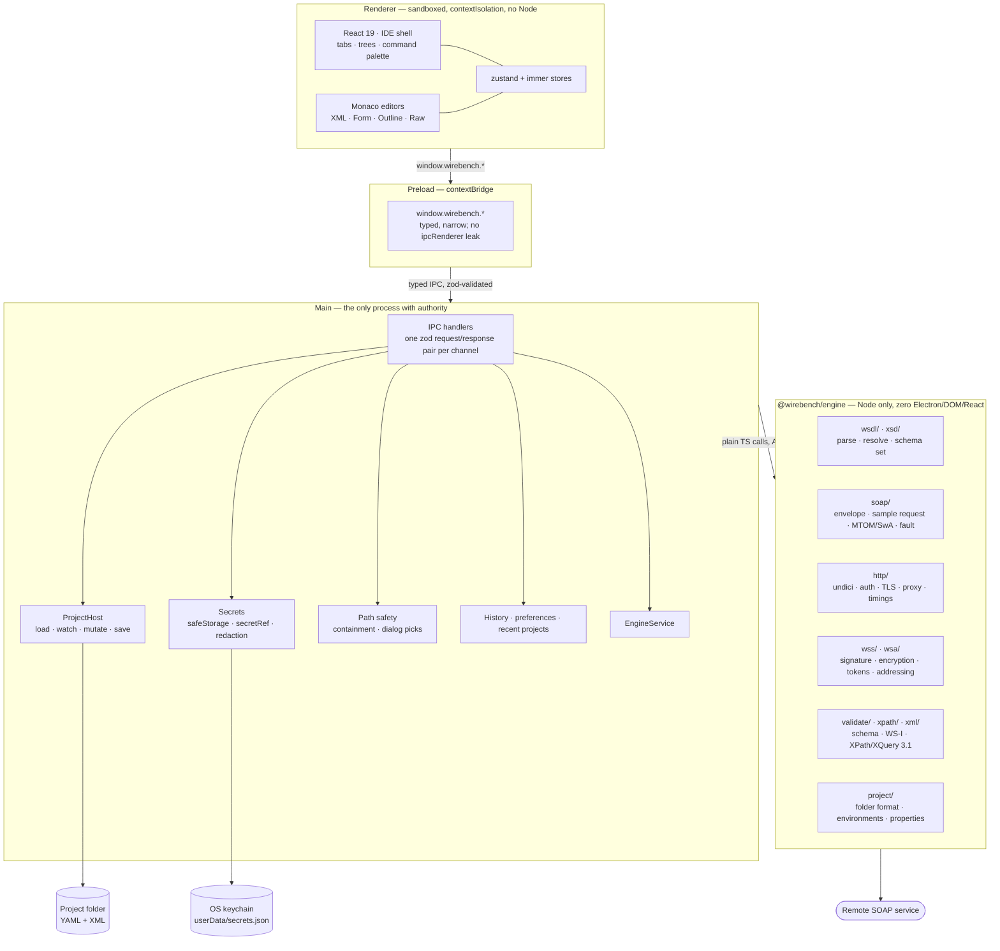

# Architecture overview

Wirebench is an Electron app in three parts: a sandboxed React renderer that draws the IDE
shell, a main process that owns every side effect, and `@wirebench/engine` — a plain Node
library that knows SOAP, WSDL, XSD and HTTP, and knows nothing about Electron.

The rule that shapes everything else: **the renderer has no network, no filesystem and no
secrets.** It asks; main decides and acts.

## The three layers

**Renderer.** React 19, zustand stores per feature, Monaco for every text surface, Radix
primitives and Tailwind v4 tokens for the shell. Every action is a *command* with an id, which
is what makes the command palette complete and the shortcut table derivable rather than
hand-maintained. The renderer holds no privileged handle: `contextIsolation: true`,
`sandbox: true`, `nodeIntegration: false`, a strict CSP, and the app's own files served over a
custom `app://` protocol.

**Preload.** One `contextBridge.exposeInMainWorld` call publishing `window.wirebench.*`.
`ipcRenderer` itself is never exposed — the renderer can call the methods that exist and
nothing else.

**Main.** Windows, menus, native dialogs, the project on disk, the keychain, history,
preferences — and the engine. Every channel is declared once in
`apps/desktop/src/shared/ipc.ts` with a zod schema for the request and for the response, so a
malformed message from either direction fails at the boundary with a typed error instead of
deeper in. Renderer-supplied paths are never trusted (ADR-0005); secrets never travel back out
(ADR-0004).

**Engine.** `packages/engine`, `@wirebench/engine`. Zero Electron, DOM or React imports —
enforced by lint, not convention. Every I/O entry point takes an `AbortSignal`, every export
carries JSDoc, every error is a `WirebenchError` subclass with a stable `code`, and every model
object is `readonly`. It is a library, not a service: the same code is meant to power the
planned `wirebench run` CLI unchanged.

## How a send actually happens

1. The user presses Send. The renderer dispatches a command and calls
   `window.wirebench.request.send(…)` with the request id — not an envelope, not an endpoint.
2. Preload forwards it over the typed channel; main validates the payload against the channel's
   zod schema.
3. Main resolves what the renderer was never given: the active environment's endpoint,
   property expansions, `secretRef`s → real credentials from `safeStorage`, keystore files
   (containment- or dialog-proven), the effective TLS and proxy settings.
4. Main calls `EngineService.send(…)` with a fully resolved request and an `AbortSignal`.
   The engine builds the envelope, applies WS-Security and WS-Addressing, prepares MTOM/SwA
   parts, and sends it through undici — capturing raw wire bytes and a timing breakdown.
5. The response comes back; main parses it, appends a redacted entry to history (stored in app
   data, keyed by project id — never in the project folder), and answers the channel.
6. The renderer renders what it was given. Cancel is the same path in reverse: one IPC call
   aborts the signal the engine is already holding.

## Where things live

| Concern | Where |
|---|---|
| WSDL/XSD parsing, resolution, schema sets | `packages/engine/src/wsdl`, `packages/engine/src/xsd` |
| Envelope generation, faults, MTOM/SwA, cURL | `packages/engine/src/soap` |
| HTTP, auth (Basic/NTLMv2), TLS, proxy, timings | `packages/engine/src/http` |
| WS-Security, WS-Addressing | `packages/engine/src/wss`, `packages/engine/src/wsa` |
| Schema + WS-I validation, XPath/XQuery | `packages/engine/src/validate`, `.../xpath` |
| Project folder format, environments, properties | `packages/engine/src/project` |
| IPC channel schemas (one file, both directions) | `apps/desktop/src/shared/ipc.ts` |
| IPC handlers | `apps/desktop/src/main/ipc/` |
| Secrets, path safety, redaction | `apps/desktop/src/main/{secrets,path-*,redact}.ts` |
| IDE shell, editors, feature panels | `apps/desktop/src/renderer/` |

## Further reading

- [ADR-0001](../adr/0001-electron-stack.md) — why Electron, and why the engine is a package
- [ADR-0002](../adr/0002-engine-in-main-process.md) — why the engine runs in main
- [ADR-0003](../adr/0003-project-folder-format.md) — the project folder format
- [ADR-0004](../adr/0004-secrets-outside-project-files.md) — secrets
- [ADR-0005](../adr/0005-renderer-path-safety.md) — path safety
- [Security model](../security.md)
- [Success criteria and their evidence](../success-criteria.md)
