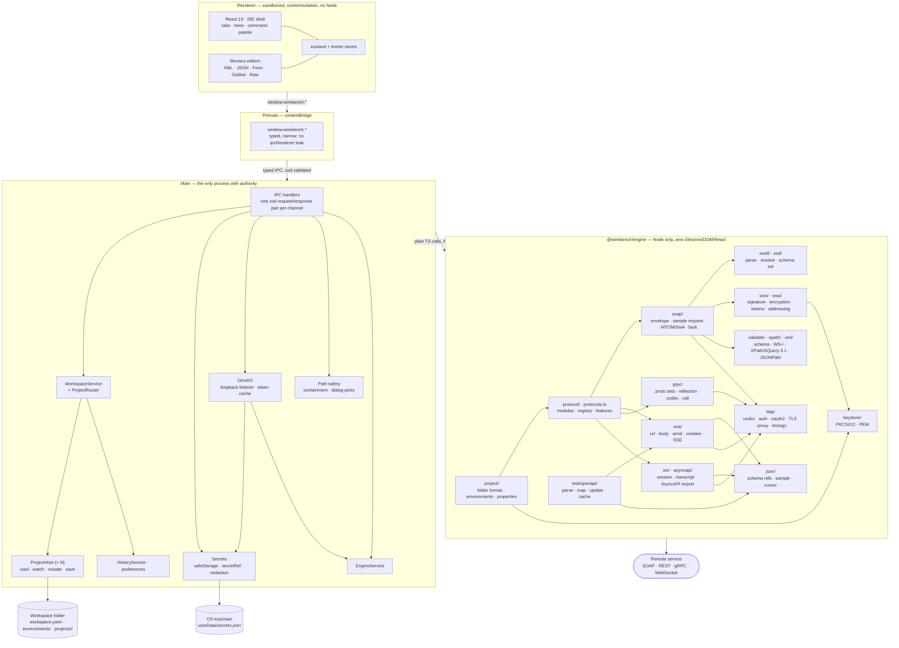

# Architecture overview

Wirebench is an Electron app in three parts: a sandboxed React renderer that draws the IDE
shell, a main process that owns every side effect, and `@wirebench/engine` — a plain Node
library that knows SOAP, WSDL, XSD, REST, OpenAPI and HTTP, and knows nothing about Electron.

The rule that shapes everything else: **the renderer has no network, no filesystem and no
secrets.** It asks; main decides and acts.

```mermaid
flowchart TB
  subgraph R["Renderer — sandboxed, contextIsolation, no Node"]
    UI["React 19 · IDE shell<br/>tabs · trees · command palette"]
    Monaco["Monaco editors<br/>XML · JSON · Form · Outline · Raw"]
    Store["zustand + immer stores"]
    UI --- Store
    Monaco --- Store
  end

  subgraph P["Preload — contextBridge"]
    API["window.wirebench.*<br/>typed, narrow; no ipcRenderer leak"]
  end

  subgraph M["Main — the only process with authority"]
    IPC["IPC handlers<br/>one zod request/response pair per channel"]
    OAuth["OAuth2<br/>loopback listener · token cache"]
    WS["WorkspaceService<br/>+ ProjectRouter"]
    Proj["ProjectHost (× N)<br/>load · watch · mutate · save"]
    Sec["Secrets<br/>safeStorage · secretRef · redaction"]
    Paths["Path safety<br/>containment · dialog picks"]
    Hist["HistoryService · preferences"]
    Eng["EngineService"]
    IPC --> WS
    WS --> Proj
    IPC --> Sec
    IPC --> OAuth
    OAuth --> Sec
    OAuth --> Eng
    IPC --> Paths
    WS --> Hist
    IPC --> Eng
  end

  subgraph E["@wirebench/engine — Node only, zero Electron/DOM/React"]
    direction LR
    Pr["project/<br/>folder format · environments · properties"]
    Mo["protocol/ · protocols.ts<br/>modules · registry · features"]
    W["wsdl/ · xsd/<br/>parse · resolve · schema set"]
    S["soap/<br/>envelope · sample request · MTOM/SwA · fault"]
    Sx["wss/ · wsa/<br/>signature · encryption · tokens · addressing"]
    V["validate/ · xpath/ · xml/<br/>schema · WS-I · XPath/XQuery 3.1 · JSONPath"]
    Re["rest/<br/>url · body · send · cookies · SSE"]
    Oa["rest/openapi/<br/>parse · map · update · cache"]
    G["grpc/<br/>.proto sets · reflection · codec · call"]
    Wk["ws/ · asyncapi/<br/>session · transcript · AsyncAPI import"]
    H["http/<br/>undici · auth · oauth2 · TLS · proxy · timings"]
    J["json/<br/>schema refs · sample · cursor"]
    K["keystore/<br/>PKCS#12 · PEM"]

    Pr --> Mo
    Mo --> S
    Mo --> Re
    Mo --> G
    Mo --> Wk
    S --> W
    S --> Sx
    S --> V
    Oa --> Re
    Oa --> J
    Re --> J
    Wk --> J
    S --> H
    Re --> H
    G --> H
    Wk --> H
    Sx --> K
    Pr --> K
  end

  Net(["Remote service<br/>SOAP · REST · gRPC · WebSocket"])
  Disk[("Workspace folder<br/>workspace.yaml · environments/ · projects/<slug>/")]
  Key[("OS keychain<br/>userData/secrets.json")]

  R -->|"window.wirebench.*"| P
  P -->|"typed IPC, zod-validated"| M
  M -->|"plain TS calls, AbortSignal"| E
  E --> Net
  Proj --> Disk
  Sec --> Key
```

## The three layers

**Renderer.** React 19, zustand stores per feature, Monaco for every text surface, Radix
primitives and Tailwind v4 tokens for the shell. Every action is a *command* with an id, which
is what makes the command palette complete and the shortcut table derivable rather than
hand-maintained. The renderer holds no privileged handle: `contextIsolation: true`,
`sandbox: true`, `nodeIntegration: false`, a strict CSP, and the app's own files served over a
custom `app://` protocol.

**Preload.** One `contextBridge.exposeInMainWorld` call publishing `window.wirebench.*`.
`ipcRenderer` itself is never exposed — the renderer can call the methods that exist and
nothing else.

**Main.** Windows, menus, native dialogs, the workspace and its projects on disk, the keychain,
history, preferences — and the engine. Every channel is declared once in
`apps/desktop/src/shared/ipc.ts` with a zod schema for the request and for the response, so a
malformed message from either direction fails at the boundary with a typed error instead of
deeper in. Renderer-supplied paths are never trusted (ADR-0005); secrets never travel back out
(ADR-0004).

**The workspace layer (ADR-0006).** `WorkspaceService` (`apps/desktop/src/main/workspace-service.ts`)
owns the one open workspace: its manifest, its environments, and one `ProjectHost` per project
in it (`apps/desktop/src/main/project-host.ts` — the renamed, otherwise-unchanged v1 project
engine, now instantiated per project instead of once globally). It implements
`ProjectRouter`, the union of every `ProjectHost` method an `ipc/*.ts` module needs, re-expressed
so each call resolves its host from the entity id already on the request (`hostFor(projectId)` /
`hostOfEntity(entityId)`) — the IPC handlers do not know or care that more than one project
exists. Storage mirrors this: `<userData>/workspaces/<id>/workspace.yaml` plus
`environments/*.yaml` for the workspace, and `projects/<slug>/` per internal project (an ordinary
ADR-0003 folder); a linked project's folder lives wherever the user pointed it, addressed via an
absolute path recorded in the manifest, never sent to the renderer. Every event that used to
carry no project context now carries `projectId` — `project.changed { projectId, project }`,
`project.changedOnDisk { projectId, paths }`, `project.hydration { projectId, interfaceId,
status }` — so the renderer's stores (`state/workspace.ts`, `state/project.ts`) can keep several
projects' worth of state keyed by id and merge tabs, history and environments across them.

**The shell layout.** There is no right panel. The activity bar (far left) picks the sidebar's
view — Explorer, Search, History, Settings and **Environments** — and a fixed-width right rail
takes its place, today holding one icon (**Code**) that opens a slide-over showing the active
request as `curl`; Escape or the rail icon again closes it. What the removed panel showed lives
elsewhere: auth, WS-Security, WS-Addressing and attachments moved into the request editor's own
*Details* inspector, and a project row opens as a *project* tab instead of a side panel. Sidebar,
console and the slide-over are all collapsible and resizable — by dragging the handle, a
titlebar button, or double-clicking the handle to snap collapsed/restored — and their sizes and
collapsed state persist across a relaunch in `ui-state` (`apps/desktop/src/renderer/state/
ui-state.ts`), together with the slide-over's own POSIX/PowerShell shell preference for the Code
view (`slideOver.codeShell`). The Environments view itself (`apps/desktop/src/renderer/features/
environments/`) lists Globals, the workspace and every environment; opening one shows its
variables and endpoint overrides, each variable with an *enabled* checkbox — see "The `disabled`
list" below.

**Engine.** `packages/engine`, `@wirebench/engine`. Zero Electron, DOM or React imports —
enforced by lint, not convention. Every I/O entry point takes an `AbortSignal`, every export
carries JSDoc, every error is a `WirebenchError` subclass with a stable `code`, and every model
object is `readonly`. It is a library, not a service: the same code runs in the desktop's main
process, in `wirebench run` and in `wirebench mcp`.

**Protocol modules (ADR-0017).** Each protocol is one module behind the `ProtocolModule` interface
(`packages/engine/src/protocol/module.ts`), defined in its own folder: `soap/module.ts`,
`rest/module.ts`, `grpc/module.ts` and `ws/module.ts`. A module has up to three facets. *Storage*
reads and writes its containers in a project folder. *Run* lists the requests a run can send, sends
one, and names the secrets it needs. *Scripting* describes what a script sees of a request and a
response. WebSocket's run facet offers no request, so its requests load and save and a run cannot send them.
`packages/engine/src/protocols.ts` is the one file that imports every module. It builds the default
*registry*, and the loader, the writer, the run loop, the secret-needs walk and the script host ask
that registry for a module by `kind` where they used to branch on it. The registry also holds the
*features*: one per protocol, plus `scripts`. Using a feature that is off is refused with
`feature-disabled`, and a container whose kind has no enabled module loads as a placeholder
(`Project.unsupported`) whose files a save leaves untouched. Every feature is on, and nothing in
the app or the CLI switches one off yet.

Two rules keep the modules apart, and `pnpm check:engine-layers` (part of `pnpm check`) enforces
both: a protocol's folders import core and themselves, never another protocol's; core imports no
protocol, apart from the exceptions ADR-0017 lists. Only that script enforces them; nothing flags a
wrong import in the editor. The protocol folders are `soap/` with `wsdl/`, `xsd/`, `wss/`, `wsa/` and
`validate/`; `rest/` with `rest/openapi/` and `webhooks/`; `grpc/`; and `ws/` with `asyncapi/`.
What they share is core: `http/` (one dispatcher for every protocol, so keystores, TLS trust, the
proxy, timeouts and raw-byte capture are shared code and not a second implementation; applying a
configured auth; header entries; cookies; charsets), `json/schema/` (`$ref` resolution across
documents, memoised per target, and sampling under a node budget, for OpenAPI and AsyncAPI alike),
`keystore/`, `xml/` and `xpath/`. `rest/browser.ts` is the browser-safe subpath
`@wirebench/engine/rest`: the URL helpers the renderer needs so the URL field and the query table
cannot disagree with what is actually sent. Nothing else in `rest/` is importable from the renderer.

## How a send actually happens

**There is one send path, and every host uses it.** A project holds SOAP, REST, gRPC and WebSocket
requests (ADR-0007, ADR-0017), and `request.send` takes an id, not a protocol. Main resolves what that
id names and hands it to the engine's `openExchange`, which asks the registry for the protocol's module
and calls its run facet's `open`. The desktop, `wirebench run`, `wirebench send` and the MCP `send` tool
all call it, so a request sends the same bytes from each. What differs between hosts is what a host
lends the send: a `SendHost`, carried on `RunContext.host`, holds the secret getter (the only required
member) and, when a host has them, the proxy, TLS trust and client identity, the OAuth2 token source,
preferences, cookies, a contract check, gRPC schemas, and hooks that report a send that failed. Where a
member is absent the send behaves as the command line's does. The desktop builds its host from its own
services (`apps/desktop/src/main/send/host.ts`); the command line builds one from the environment.

`open` returns an `ExchangeHandle` with the live events, `push`, `halfClose`, `close` and `cancel`, and
a `result` that rejects with the send's error: a send's own failure never throws from `open`. It throws
at once only when nothing can be opened: a protocol that is unknown or switched off, one with no run
facet, or a request handed to a module of another kind. `resolve` is the same first step on
its own: what a send would send, with nothing connected, for a cURL export or a preview. A message
pushed to a send that takes none is refused with `exchange-not-streaming`. A run bounds every stream by
its timeout.

**The prepare order is the same for every protocol:**

1. Resolve the request: property expansion across `Env → Project → Workspace → Global`, the endpoint
   (the active environment's, then the project's, then the interface's default, ADR-0006), and the
   saved definition. A reference nothing resolves refuses the send with its protocol's
   `…-unresolved-properties` code (SOAP keeps `unresolved-properties`); a gRPC request with no method is
   refused with `grpc-method-unset`.
2. Run the pre-request script, if the request has one. It sees the request as resolved and no token.
3. Read the `secretRef`s the request lists, then obtain the OAuth2 token and choose the proxy (for the
   token URL as well as for the request's own URL), keystores and TLS trust.
4. Connect and send; capture raw wire bytes and a timing breakdown; read the response.

A refusal at any step before the connection is reported to the host as a failure at the `prepare` stage
and sent nothing.

The walk-through of the desktop's side, for a SOAP request:

1. The user presses Send. The renderer dispatches a command and calls
   `window.wirebench.request.send(…)` with the request's project id and the request id — not an
   envelope, not an endpoint.
2. Preload forwards it over the typed channel; main validates the payload against the channel's
   zod schema, and `WorkspaceService` resolves the `projectId` to the right `ProjectHost`.
3. Main builds the `SendHost` from what the renderer was never given: `secretRef`s → real credentials
   from `safeStorage`, keystore files (containment- or dialog-proven), the effective TLS and proxy
   settings, the cookie jar.
4. `sendThroughEngine` calls `openExchange` with the selected request, the host and an `AbortSignal`.
   The engine runs the steps above: for SOAP it builds the envelope, applies WS-Security and
   WS-Addressing, prepares MTOM/SwA parts, and sends it through undici.
5. The response comes back; main records the HTTP Log row, and `HistoryService` appends a redacted
   entry (stored in app data, keyed by project id — never in the project folder, and merged
   newest-first across every open project for the History view), and answers the channel. Redaction
   stays in each host, not in the engine.
6. The renderer renders what it was given. Cancel is the same path in reverse: one IPC call
   aborts the exchange's signal, which also stops a send still being prepared.

## The OAuth2 loopback listener

The authorization-code grant needs a redirect URI the authorization server can reach, and the only
one that does not involve running a server somewhere is `http://127.0.0.1:<port>/callback`. So main
(`apps/desktop/src/main/oauth2.ts`) opens the authorization URL in the user's **own browser** — via
`shell.openExternal`, never in a `BrowserWindow`, so the user is typing their password into their own
browser with its own password manager and its own address bar, not into a window Wirebench drew — and
listens on loopback for the redirect.

What bounds that listener:

- It binds **`127.0.0.1` only**, never `0.0.0.0`, so nothing off the machine can reach it.
- It exists **only while an authorization is pending**: started when the flow starts, closed as soon
  as the code arrives, the user cancels, or the flow times out. There is no listener at rest.
- It accepts **exactly one callback**, identified by the `state` parameter it generated before the
  browser was opened. A request whose `state` does not match is answered with a page saying so and
  is neither accepted nor allowed to end the flow, which stays pending for the real one; a request
  arriving after the flow is over gets a `410`. (The path is not what identifies the callback —
  `state` is — so any path on the listener reaches the same one-shot handler.)
- **PKCE (S256) is on by default** for a newly configured authorization-code grant, so an
  intercepted code is useless without the verifier, which never leaves main. It is a per-config
  switch rather than a hard rule, because a provider that rejects an unexpected `code_challenge`
  would otherwise be unusable; `plain` is not offered at all.
- The port is ephemeral by default; a fixed port is configurable because some authorization servers
  only allow a pre-registered redirect URI, and the API tab says which URI to register.
- The **access and refresh tokens never reach the renderer** as values. They live in main's memory
  for the session; a refresh token is written to the OS keychain only if the user ticks *remember*,
  and then as a `secretRef` like every other credential (ADR-0004). A token is redacted out of
  History, out of the Raw view and out of an exported cURL command unless *show secrets* is on.

## The `disabled` list

Every property scope — a project's own, an environment's, a workspace's, a workspace
environment's, and the global file — can disable one variable without deleting it: its value
stays in the `properties` map, but resolution skips it, so the request falls through to the next
scope down as if the value were absent. On disk this is a sibling `disabled:` list of names next
to the `properties` map (which itself stays a plain `name -> value` map), sorted, deduplicated,
and omitted entirely when it would be empty; a file with no `disabled` key migrates as "all
enabled". `enabledProperties` (`packages/engine/src/project/properties.ts`) is the one place the
filter is applied. This is an additive format change: project and workspace manifests moved to
`formatVersion: 2` and the global properties file to `version: 2` (ADR-0003, ADR-0006). A
version-1 file still loads (a missing list defaults to empty); a file from a newer build than
this one is refused with the same clear error a too-new file has always produced — except the
global properties loader (`apps/desktop/src/main/global-properties.ts`), which does not check its
`version` field at all yet (tracked in `docs/roadmap.md`'s "Known limitations carried from 1.0").
A 1.0.0 build cannot open a file this build has saved: it refuses `formatVersion: 2` with its
existing "created by a newer version of Wirebench" error.

## Format version

The project format has kept moving the same way since: APIs beside interfaces took it to
`formatVersion: 3` (ADR-0007), and the CLI runner's `assertions:` and named secret references
(`…Env` beside a `passwordRef`/`tokenRef`/`valueRef`/`clientSecretRef`) take it to
`formatVersion: 4`, and Bearer, API-key and OAuth2 auth on a SOAP interface, endpoint or request
(`soapOwnerAuthSchema`) takes it to `formatVersion: 5` (`FORMAT_VERSION` in
`packages/engine/src/project/model.ts`) — each step adds
fields an older file simply lacks, which the loader defaults, and each still bumps the version
because this format drops unknown keys on save. An older project migrates to 5 in memory with no
data moved; the CLI never writes a project (it only writes report files), so it can run an older
project unmigrated on disk. A build older than the one that wrote `formatVersion: 5`
refuses it with the same "created by a newer version of Wirebench" error `formatVersion: 2`
introduced.

## Where things live

| Concern | Where |
|---|---|
| WSDL/XSD parsing, resolution, schema sets | `packages/engine/src/wsdl`, `packages/engine/src/xsd` |
| The protocol interface, the registry, features | `packages/engine/src/protocol` |
| The built-in modules composed; the default registry | `packages/engine/src/protocols.ts` |
| WSDL import, sample requests, the SOAP send, envelopes, faults, MTOM/SwA | `packages/engine/src/soap` |
| REST URL, bodies, send, the cookie jar, cURL; webhook items | `packages/engine/src/rest`, `packages/engine/src/webhooks` |
| OpenAPI import, mapping, Update Definition, the definition cache | `packages/engine/src/rest/openapi` |
| gRPC calls, `.proto` sets, server reflection | `packages/engine/src/grpc` |
| WebSocket sessions; AsyncAPI import | `packages/engine/src/ws`, `packages/engine/src/asyncapi` |
| JSON Schema `$ref` resolution, parsing and sampling | `packages/engine/src/json/schema` |
| HTTP, auth (Basic, NTLMv2, OAuth2 token requests and PKCE, applying a configured scheme), header entries, cookies, charsets, TLS, proxy, timings | `packages/engine/src/http` |
| WS-Security, WS-Addressing | `packages/engine/src/wss`, `packages/engine/src/wsa` |
| Keystores (PKCS#12, PEM) | `packages/engine/src/keystore` |
| Selection, the run loop, secret needs | `packages/engine/src/run` |
| The script sandbox, the checker, the rules on a changed request | `packages/engine/src/script` |
| Schema + WS-I validation, XPath/XQuery/JSONPath | `packages/engine/src/validate`, `.../xpath` |
| Project folder format, environments, properties | `packages/engine/src/project` |
| Workspace format, environments, properties (`${#Workspace#…}`) | `packages/engine/src/workspace` |
| IPC channel schemas (one file, both directions) | `apps/desktop/src/shared/ipc.ts` |
| IPC handlers | `apps/desktop/src/main/ipc/` |
| WorkspaceService, ProjectHost, ProjectRouter, HistoryService | `apps/desktop/src/main/{workspace-service,project-host,project-router,history-service}.ts` |
| Secrets, path safety, redaction | `apps/desktop/src/main/{secrets,path-*,redact}.ts` |
| Desktop areas: the `AreaModule` contract and the static `AREAS` list; renderer and main halves; the SSH area (hosts, terminal) | `apps/desktop/src/shared/area-module.ts` and `shared/areas/`, `renderer/areas/index.ts`, `main/areas.ts`; `packages/ssh`, `main/{hosts-service,ssh-service}.ts` |
| OAuth2 flows and the loopback listener | `apps/desktop/src/main/oauth2.ts` |
| REST send path, OpenAPI import, REST project mutations | `apps/desktop/src/main/{rest-send,openapi-import,project-rest-mutations}.ts` |
| IDE shell, editors, feature panels | `apps/desktop/src/renderer/` |
| Environments view (sidebar list + editor page) | `apps/desktop/src/renderer/features/environments/` |
| REST editor, API tab, import dialog | `apps/desktop/src/renderer/features/{rest-editor,rest-api}/`, `.../features/explorer/import-openapi-dialog.tsx` |
| Right rail, Code slide-over, resizable/collapsible panel handles | `apps/desktop/src/renderer/shell/{right-rail,code-panel,panel-handle}.tsx` |
| Request details inspector, project tab | `apps/desktop/src/renderer/features/request-editor/inspectors/details-inspector.tsx`, `apps/desktop/src/renderer/features/project/project-tab.tsx` |
| Global properties file (`disabled` list, `version: 2`) | `apps/desktop/src/main/global-properties.ts` |

## Desktop areas

The activity bar, the sidebar views, their `view.show*` commands and their IPC channels are not named by the shell. Each
is an *area*: an `AreaModule` (`apps/desktop/src/shared/area-module.ts`) with an id, an engine feature descriptor, a rail
item and sidebar copy, composed in the static `AREAS` list, from which `AreaId` is derived. The renderer half
(`renderer/areas/index.ts`) supplies the sidebar view and the area's extra commands; the main half (`main/areas.ts`)
registers its channels. `WIREBENCH_AREAS="ssh=off"` switches an area off: main registers none of its channels, the
renderer none of its commands, and the rail leaves it out (`app.areas` carries the enabled ids). The contract is
`@internal`, not a plugin API. The SSH area is the first area to bring its own tab kind and channels; its model and
sessions live in `packages/ssh`, which imports neither the engine nor Electron. See
[ADR-0021](../adr/0021-a-desktop-area-is-a-module-behind-one-interface.md).

## Further reading

- [ADR-0001](../adr/0001-electron-stack.md) — why Electron, and why the engine is a package
- [ADR-0002](../adr/0002-engine-in-main-process.md) — why the engine runs in main
- [ADR-0003](../adr/0003-project-folder-format.md) — the project folder format
- [ADR-0004](../adr/0004-secrets-outside-project-files.md) — secrets
- [ADR-0005](../adr/0005-renderer-path-safety.md) — path safety
- [ADR-0006](../adr/0006-workspaces-in-app-data.md) — workspaces live in app data
- [ADR-0007](../adr/0007-apis-beside-interfaces.md) — a REST API is a sibling to a SOAP interface
- [ADR-0008](../adr/0008-shared-workspaces-are-git-repositories.md) — shared workspaces are git
  repositories, synced by system git
- [ADR-0009](../adr/0009-wirebench-server-is-a-fastify-postgres-process.md) — Wirebench Server
  is one Fastify process over PostgreSQL
- [ADR-0017](../adr/0017-a-protocol-is-a-module-behind-one-interface.md) — a protocol is a module
  behind one interface
- [ADR-0021](../adr/0021-a-desktop-area-is-a-module-behind-one-interface.md) — a desktop area is a
  module behind one interface
- [Security model](../security.md)
- [Success criteria and their evidence](../success-criteria.md)
