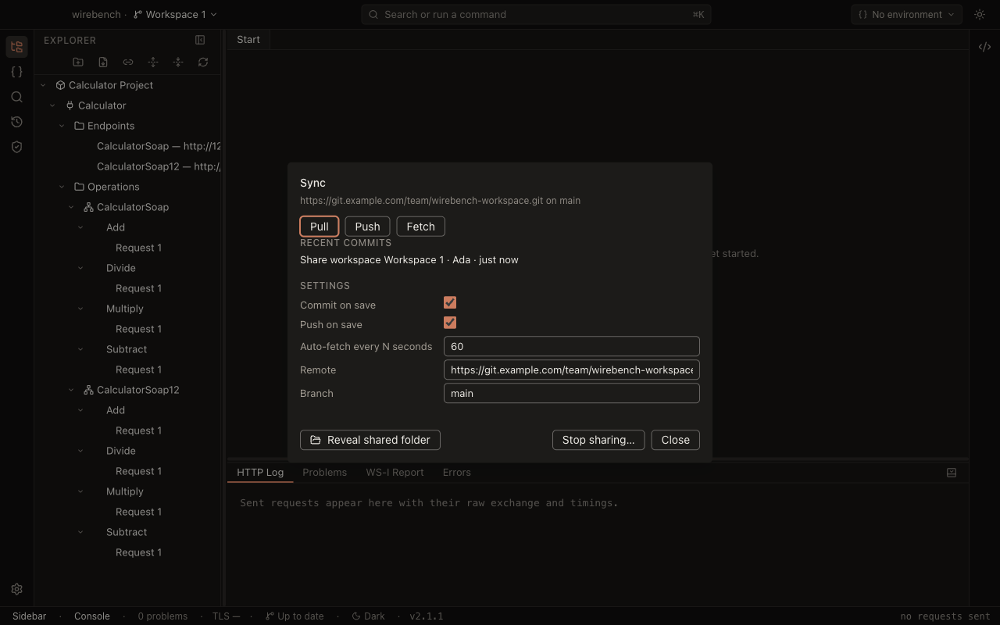
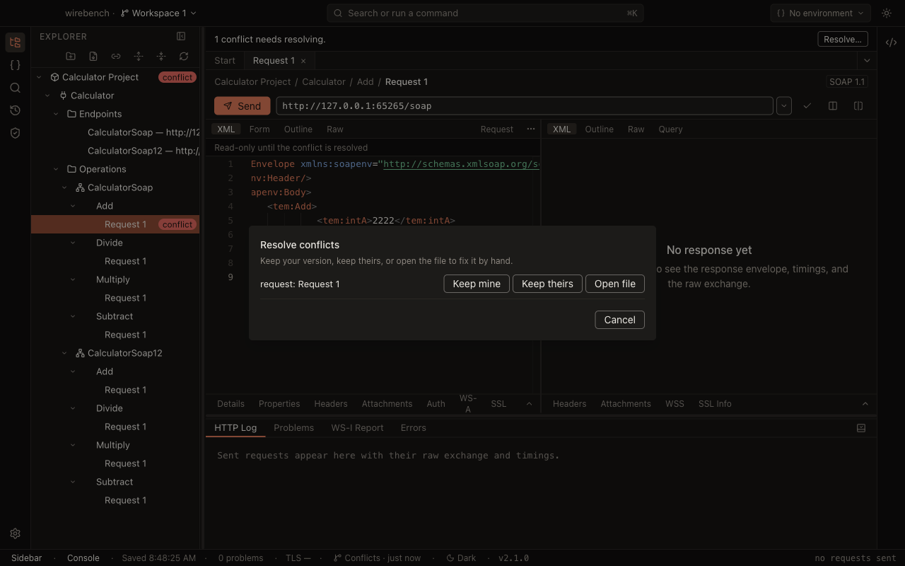

# Collaborate on a shared workspace

A workspace can be shared with a team. Members join by URL (or by pointing at an existing
folder, or by opening it from Wirebench Server), every save becomes a commit, and Sync pulls,
merges and pushes so everyone converges on the same projects and environments. Design: [`specs/2026-09-13-wirebench-shared-workspaces-design.md`](specs/2026-09-13-wirebench-shared-workspaces-design.md)
and, for Wirebench Server, [`specs/2026-09-24-wirebench-server-sync-design.md`](specs/2026-09-24-wirebench-server-sync-design.md);
the decision to build this on git is [ADR-0008](adr/0008-shared-workspaces-are-git-repositories.md),
and the server's merge is [ADR-0012](adr/0012-server-sync-merges-on-the-client.md).

## What a shared workspace is

A workspace normally lives entirely under Electron's app-data folder (ADR-0006). Sharing it turns
its **tree** — `workspace.yaml`, `environments/`, `projects/<slug>/`, `.gitattributes` — into
either:

- **a git repository**, synced by Wirebench's own Sync control over the system `git`, or
- **a synced folder**, replicated by whatever tool you already point at that folder (Dropbox,
  OneDrive, Syncthing, a network share) — Wirebench just reads and writes the files there and has
  no Sync control of its own for it, or
- **a team workspace on Wirebench Server**, synced by the same Sync control over HTTP, with no git
  needed on your machine (see [Share with Wirebench Server](#share-with-wirebench-server)).

Everything that must never leave your machine — which environment you have active, your unsaved
edits, secret values, history, preferences — stays in the workspace's app-data folder and is never
written into the tree. See [What travels and what stays](#what-travels-and-what-stays) below.

## Share a workspace

From *Manage workspaces* (or the workspace switcher), choose **Share this workspace…** on a local
workspace:

- **Git repository** (the default) — enter a remote URL (optional; you can add one later from the
  Sync panel) and a branch, which defaults to `main`. Wirebench moves the tree into place,
  initialises the repository, writes `.gitattributes`, makes the first commit, and pushes it if
  you gave a remote. The remote must be **empty**: a repository that already has history of its
  own is not merged into the new workspace, and the push is refused (git refuses unrelated
  histories). Create an empty repository on your host for each shared workspace.
- **Synced folder** — click **Choose folder…** and pick an empty folder (native dialog). Wirebench
  moves the tree there; nothing else changes hands.

If sharing fails after you had already stopped sharing this same workspace once, see
[Re-sharing after Stop sharing](#stop-sharing) below — you likely need to delete `tree/.git`
first.

## Join a shared workspace

From the workspace picker, choose **Join shared workspace…**:

- Paste the git URL (`git@host:team/workspace.git`, `https://…`, or `ssh://…`) and, optionally, a
  branch. Wirebench clones it, reads the manifest's id, and opens it.
- **Use existing clone or synced folder…** picks a folder (native dialog) that is already a git
  checkout or an existing synced folder containing a `workspace.yaml`. An existing clone must have
  an `origin` remote in one of the allowed forms (`https://`, `ssh://`, `file://`, or
  `user@host:path`) and must not be on a detached HEAD — check out a branch first if it is.
  Before running anything else in a repository it did not create itself, Wirebench checks that
  its `.git/config` sets only the handful of settings `git clone` writes (plus identity, line
  endings and fetch/pull options), with an allowed `origin` URL, and refuses the folder otherwise —
  see `git-config-refused` under [Troubleshooting](#troubleshooting).

Joining a workspace whose id is already on this machine is refused; the join dialog says so and
offers **Open it** for the one already there instead. In the picker, a shared workspace's row shows the remote's host (for a git
share) or "Synced folder".

## What travels and what stays

| Travels in the tree | Stays on the machine |
| --- | --- |
| `workspace.yaml` (name, description, properties, disabled list, project list) | active environment (`local.yaml`) |
| `environments/*.yaml`, including endpoint overrides | share configuration (`share.yaml`) |
| every internal project: interfaces, definitions, operations, requests, WSS config, attachments | unsaved records and drafts (`unsaved/`) |
| `.gitattributes` | secret values, history, preferences, UI state |

Only **internal** projects live inside a shared workspace's tree. *Link Project Folder…* is
unavailable there (disabled, with a tooltip explaining why) — a linked project points at a path
outside the tree, which a teammate's machine cannot resolve. A linked project that still appears
in a shared `workspace.yaml` (edited by hand, or pulled from a teammate) is listed as an error and
never opened; Wirebench does not read, watch or write that folder. Use **Move to workspace…** (project
context menu) instead: it copies the project's files into the target workspace, keeping its id
unless that id already exists there, in which case the copy is re-identified. The move always
asks for confirmation, because the project's files here go to the trash afterwards.

## Sync: pull, push, commit

The status bar shows a Sync badge once a workspace is shared — its label follows the sync state:
*Up to date*, *N to push*, *N to pull*, *Diverged*, *Conflicts*, *Syncing…*, *Offline*, *Error*, or
*No git* (a git share on a machine where git could not be found) and *Synced folder* (no Sync
control at all). Clicking it opens the **Sync panel** with:

- **Pull / Push / Fetch** buttons, and (when *Commit on save* is off) a commit-message field —
  leave it empty and Wirebench writes a generated one.
- **Conflicts**, when there are any, each with a **Resolve…** shortcut into the conflict resolver.
- **Recent commits** — the last 20, each with its subject, author and a relative time.
- **Settings** — *Commit on save*, *Push on save*, *Auto-fetch every N seconds* (0 turns it off;
  up to 86,400), *Remote* and *Branch*.
- **Reveal shared folder** and **Stop sharing…**.

**Commit on save.** With it on (the default), every successful save runs `add -A` + commit with a
generated message — `Update GetWeather in Weather`, `Add environment QA`, `Update 3 requests, 1
environment` with one path per line, `(autosave)` appended for an autosave-triggered commit. With
it off, saves stay uncommitted until you use **Commit** with your own message.

**Push on save.** With it on (the default), every commit is pushed right away. A push rejected as
non-fast-forward triggers one fetch + merge + retry automatically; if that merge conflicts, the
conflict flow below takes over and the push waits. Commits still waiting when a shared workspace
opens — changes made while it was closed, or a push that failed last time — are pushed right after
the opening fetch, unless the remote has new commits too; then the next pull or save merges first.

**Fetch** runs on open, on demand, and on the auto-fetch interval. It never changes files, only the
ahead/behind counts. A failed fetch marks the workspace *Offline* and backs the interval off to
five minutes until one succeeds.

**Pull** is fetch + merge. If you have uncommitted changes (*Commit on save* off) and haven't
committed them, Pull is refused until you do. After a pull that changed files, a clean project
reloads from disk without asking; a project with unsaved edits gets the existing *Changed on disk*
banner (Reload / Keep). A banner also names how many changes were pulled and from which host, and
dismisses itself after a few seconds.

## Conflicts

When a merge leaves conflicted files, the sync banner offers **Resolve…**, which opens the conflict
resolver. The resolver lists each conflicted entity by name (for example `request: Ping`) with
three choices: **Keep mine**, **Keep theirs**, and **Open file** to edit it by hand in your file
manager and resolve it outside the app. **Cancel**, in the resolver, aborts the whole merge
(with a confirmation, since it discards every resolution made so far in this merge and the pull
that started it).

While a conflict is open, conflicted requests are read-only in the editor and marked in the
explorer — nothing in the app writes to a file mid-conflict. Once every conflicted file is
resolved, Wirebench commits the merge and reloads.

## First commit: setting your identity

The first time a shared workspace needs to commit and neither the repository nor your global git
config sets both `user.name` and `user.email` (a name and address git would only guess from your
account and computer name do not count), a dialog asks for your name and email once and writes them into the repository's
own (local) git config — not a Wirebench-wide identity. There is no way to dismiss this dialog
without answering it, since a commit cannot happen without an identity.

## Secrets

Secret refs (the `sec_…` ids) travel with the workspace like everything else; the values behind
them never do — they stay in each member's OS keychain. Open a request whose secret ref has no
value on this machine and the field shows **Not on this machine** with an **Enter…** button;
typing a value there stores it locally under the same ref, so the shared files are untouched and
your teammates' files never change. A send with a value still missing fails with a specific
message naming the field.

**Known limitation.** Only two failure paths — an endpoint's saved password on send, and a WSDL
import's Basic-auth password — show that named message at the moment of failure. A missing
keystore passphrase, proxy password, or WS-Security secret fails without naming itself the same
way; check the relevant field for *Not on this machine* if a send fails unexpectedly in a shared
workspace.

## Synced folders

A `folder` share has no Sync control: whatever tool watches that folder is in charge of getting
files to other members, and Wirebench just reloads what changes on disk, the same way it reacts to
external git commands. Two people saving the same file at the same time race on whatever your
sync client does about it — usually last-write-wins, with a conflicted copy Wirebench does not
know about and will not merge. **Use a git share for anything beyond a single person working
across their own machines.** If a folder gains a `.git` directory (for example, because you ran
`git init` in it yourself), Wirebench treats it as a git share the next time the workspace opens,
provided git is found and the repository's `.git/config` passes the allow-list described under
`git-config-refused`.

## Stop sharing

From the Sync panel, **Stop sharing…** moves the tree back to the workspace's app-data folder and
turns the workspace local again; nothing is deleted; the `.git` directory is left in place next to
the tree, for you to delete by hand if you no longer want it. Stopping is refused if the shared
folder or its `workspace.yaml` cannot be found — sharing cannot be stopped safely without them.

### Re-sharing after Stop sharing

Sharing again with **Share this workspace…** is refused with *"This workspace still has the git
folder from when it was last shared. Delete `tree/.git` to share it again."* if a `.git` directory
is still there. Delete `tree/.git` (in the workspace's own folder, or the external folder if you
had a synced folder), then share again — reusing the old repository silently would risk pushing to
a remote you did not choose this time.

## Git preferences

**Preferences → Git** shows the git executable Wirebench will run and its version — *Checking…*
while it is still detecting, `git <version>` once found, or *Not found — install git to sync
workspaces* once a detection attempt has actually come back empty. **Locate…** opens a native file
dialog to pick a specific git binary; **Clear** (shown only once you have picked one this way)
returns to automatic discovery. A path typed by hand into `preferences.yaml` is ignored until it
is picked through **Locate…** in the app — this mirrors how the TLS CA bundle path works.

Discovery order: the path from *Locate…* (if any), then `PATH`, then the usual install locations
per OS. Minimum supported version is git 2.20.

## Host recipes

Any git remote works. A few notes per host and per OS:

**GitHub, GitLab, Azure DevOps, Gitea/Forgejo.** Use whichever URL form your host's clone dialog
gives you: `https://…` with a credential helper, or `git@host:owner/repo.git` with an SSH key.
Wirebench never asks for a git password itself — if `https://` prompts you at the terminal today,
set up your platform's git credential manager first (Git Credential Manager on Windows and macOS,
`libsecret` or a keyring helper on Linux) so git can authenticate without a prompt.

**SSH keys.** Add your public key to the host's settings as you normally would; Wirebench runs the
system git with your normal SSH configuration (`~/.ssh/config`, `ssh-agent`) honoured — nothing
in the app touches your keys. The one difference from running git yourself: unless you already
have an `SSH_ASKPASS`-free setup (a custom `GIT_SSH_COMMAND`, `GIT_SSH`, or a repository/global
`core.sshCommand`), Wirebench adds `ssh -o BatchMode=yes` so a host-key or passphrase prompt fails
fast with a clear error instead of hanging silently — the app never shows an SSH prompt of its
own. If you already set one of those yourself, your command is used exactly as you configured it.

**Credential helpers per OS.**

- **macOS**: `git config --global credential.helper osxkeychain` (or the one Xcode's git ships
  configured already).
- **Windows**: Git for Windows installs Git Credential Manager by default.
- **Linux**: `git config --global credential.helper libsecret` (needs the `libsecret` dev package
  at build time) or your distribution's keyring integration.

**Windows long paths.** A deep interface/operation/request tree can exceed Windows' default path
length. If clone or checkout fails on long paths, run
`git config --global core.longpaths true` once and retry.

## Sign in to a server

A team that runs Wirebench Server signs in to it from the app. Run **Account: Sign in to a
server…** from the palette, use the status bar's **Sign in**, or **Add server…** under Settings →
Accounts, then:

1. Enter the server's address. Wirebench checks that it is a Wirebench Server of a version this app
   understands and remembers the address as its origin (`https://wirebench.example.com`).
2. Sign in the way the server allows: with an email and password, or with **Continue with
   <provider>** when the server is connected to the team's identity provider — that opens your
   browser and comes back to the app when the provider is done. **Have an invitation code?** takes
   the code from an invitation link (an admin sends it) and lets you choose your display name and
   password.

Once signed in, the status bar shows your email. The session is a device token the server issued to
this installation: it lives in the OS keychain (`secrets.json` names it under `wirebench-server:<url>`,
the value is never in a file) and expires after 30 days without use, or 180 days at most. The
password is sent once to the server and kept nowhere.

**Sign out** (status bar → *Sign out of <server>*, or Settings → Accounts) revokes the token on the
server and forgets it here. If the server stops accepting the token — an admin removed the device, it
expired — the app says so once, with **Sign in again**, and does nothing on its own.

Admins manage accounts from the server: `wirebench-server admin invite <email>` prints an invitation
link, and the API under `/api/v1/users` and `/api/v1/invitations` does the rest (see the server's
README). Nothing in the app needs a server; without one, no account UI is shown and no network call
is made.

## Teams and roles

On Wirebench Server, every shared workspace belongs to a team, and what you can do in it depends on your role.
Open **Account: Manage teams…** from the palette, the status bar's account menu, or **Manage teams…** beside a
signed-in server under Settings → Accounts.

- **Teams.** A server admin creates a team and adds its first admin. Team admins add people who already have an
  account, or invite someone by email. The invitation link is shown once, with **Copy**, and whoever accepts it
  joins the team with the role it names. Anyone can leave a team; a team always keeps at least one admin.
- **Workspace roles.** A workspace has three roles: *viewer* can pull, *editor* can also push, and *admin* can also
  change its settings and access. Your role comes from, in order:
  1. being a server admin or an admin of the workspace's team (always *admin*);
  2. a grant a workspace admin gave you;
  3. the workspace's default role, which starts as *viewer* and can be *none*.

  Whoever creates a workspace gets an *admin* grant on it.
- **Access.** On the **Workspaces** tab, **Access…** lists everyone on the team, the role they end up with, and
  where it comes from. A workspace admin sets a grant per person, or **Use default** to remove it. A team admin's
  role cannot be lowered by a grant.

If you have no role in a workspace, the server does not show it to you at all. Members who are not admins see the
same dialog read-only, so everyone can check their own access.

## Share with Wirebench Server

Once you are [signed in to a server](#sign-in-to-a-server) and on a [team](#teams-and-roles), a workspace
can live on the server instead of a git remote. Sync works as it does for git — the same badge, panel,
conflict resolver and settings — but Wirebench talks to the server over HTTP, so nobody needs git
installed.

**Share a local workspace.** In *Manage workspaces*, choose **Share this workspace…**, then **Wirebench
Server** (offered once you are signed in). Pick the server (when you are signed in to more than one) and
the team, then either:

- **A new workspace** — named after yours unless you change it, with the team's **default role**: *No
  access*, *Viewer* (the default) or *Editor*. You become its admin. The name must be free in that team.
- **An existing empty workspace** — one a team admin created under *Manage teams* that nobody has shared
  into yet, and that you can edit. Your local workspace takes that workspace's name and id, so everyone
  ends up on the same one.

Sharing moves the workspace's files into its managed tree, makes the first commit (*Share workspace
&lt;name&gt;*) and pushes it. If the push cannot reach the server, the workspace stays shared and *ahead*
and pushes on the next sync.

**Open a team workspace.** On the workspace picker (once a server is known) or from the palette
(**Open Team Workspace…**), the dialog lists every workspace your teams share on every
server you are signed in to, with its team and your role. An empty workspace is not listed until someone
shares into it. Choosing one downloads it and opens it. If it is already on this machine, the dialog
offers to open that copy instead.

**Viewers.** With the *viewer* role, the badge reads *Viewer*. You can still edit, send and save, and
*Commit on save* keeps a local history. **Push** and **Push on save** are disabled with the reason, and
your commits stay on this machine. When an admin makes you an editor, the next fetch picks it up and
pushes what was waiting (with *Push on save* on).

**How it syncs.** A pull asks the server what changed since your last sync and merges on your machine
with the same three-way merge a git share uses ([ADR-0012](adr/0012-server-sync-merges-on-the-client.md)).
A push sends your commits; if someone pushed first, Wirebench pulls, merges and pushes again. Conflicts
open the same resolver. The Sync panel shows the server and the team where a git share shows its remote
and branch; *Auto-fetch*, *Commit on save* and *Push on save* work the same way.

**When sync stops.** If you are signed out, your account is disabled, or you no longer have access to the
workspace, the badge says *Sign in*, *Account disabled* or *No access*, and automatic fetching stops so the
server is not asked again and again. Your files stay on this machine. **Sign in…** in the Sync panel opens
the Sign in dialog for that server; once you sign in again, sync resumes by itself. A manual **Fetch** also
tries again.

**Stop sharing and share again.** **Stop sharing…** makes the workspace local again and keeps the server
copy for your team; a team admin deletes it under *Manage teams*. Sharing the same workspace again later
reconnects to that copy: as an editor, Wirebench merges your files with the server's (identical files
merge cleanly, different ones go to the resolver) and pushes. As a viewer, you are asked to remove your
local copy and open the server's with *Open a team workspace…*.

**Limits.** A push or a download carries at most the server's body limit, 32 MiB by default
(`WIREBENCH_SERVER_BODY_LIMIT_MB`), and each file at most 8 MiB. Run **one server instance per data
directory**: pushes to a workspace are serialised by a lock inside the server process, so two instances
sharing a data directory could interleave them.

## Troubleshooting

| Error | What it means | What to do |
| --- | --- | --- |
| `git-not-found` | Wirebench could not find a usable git executable | Install git, or pick one with **Locate…** in Preferences → Git |
| `git-auth-failed` | git could not authenticate with the remote | Check your credential helper or SSH key/agent for that host; Wirebench never prompts for a git password itself |
| `git-offline` | git could not reach the remote | Check your network and the remote's availability; the badge shows *Offline* and retries every five minutes |
| `git-remote-refused` | The remote URL is not in an allowed form | Use `https://`, `ssh://`, `file://`, or `user@host:path` |
| `git-branch-refused` | The branch name is not allowed, or the repository is on a detached HEAD | Check out a real branch, or choose a different branch name |
| `workspace-git-leftover` | The tree still has a `.git` directory from a previous share | Delete `tree/.git`, then share again |
| `workspace-tree-missing` | The shared folder or its `workspace.yaml` could not be found | Reconnect the folder (for an external share) before trying to stop sharing |
| `sync-uncommitted` | You have uncommitted changes and *Commit on save* is off | Commit or discard them before pulling |
| `sync-no-remote` | This share has no remote configured yet | Add one from the Sync panel's *Remote* setting |
| `workspace-already-shared` | *"&lt;name&gt;" is already shared.* | Nothing to do; use the Sync panel to change its settings, or **Stop sharing…** first |
| `workspace-not-shared` | *"&lt;name&gt;" is not shared.* | Stop sharing and the Sync actions only apply to a shared workspace |
| `workspace-already-present` | *"&lt;name&gt;" is already on this machine.* | Click **Open it** in the join dialog to open the copy already here |
| `share-path-invalid` | *Choose a folder outside the app’s own data folder.* | Pick a folder that is not inside Wirebench's app-data folder |
| `folder-not-empty` | *Choose an empty folder to share the workspace into.* — or, when stopping, *The workspace’s own folder already holds workspace files, so the shared files cannot be brought back.* | Pick an empty folder; when stopping, move the stray workspace files out of the workspace's app-data folder first |
| `share-linked-project-refused` | *Shared workspaces hold their projects inside the workspace…* — sharing or linking was refused, or a linked project in a shared `workspace.yaml` was not opened | Remove the linked project, or use **Move to workspace…** from a local workspace to copy it in |
| `git-identity-needed` | *Set the name and email your commits are recorded under.* | Enter your name and email in the dialog; the commit that asked is retried with its own message |
| `workspace-move-incomplete` | *The files were copied, but the originals could not all be removed.* | The copy is complete; delete the leftover source files by hand |
| `git-config-refused` | *This repository's .git/config sets &lt;keys&gt;, which Wirebench does not allow in a repository it did not create…* — a folder you joined from (or a synced folder holding `.git`) has local git settings beyond what `git clone` writes, or a remote URL in a form that is not allowed | Remove those keys from the repository's `.git/config`, or move them to your global git config (`git config --global …`), and fix the remote URL if it is named; then open the workspace again. Only `core.*` line-ending/filesystem defaults, `user.name`/`user.email`, `remote.*.url`/`fetch`/`tagopt`/`prune`, `branch.*.remote`/`merge`/`rebase`, `pull.rebase`/`ff`, `fetch.prune`, `init.defaultBranch` and `gc.auto` are accepted locally |
| `sync-offline` | *Wirebench Server cannot be reached.* | Check your network and the server; changes stay on this machine and push on the next sync |
| `sync-signed-out` | The badge says *Sign in*: this server has no session for you, or it stopped accepting it | Click **Sign in…** in the Sync panel and sign in; sync resumes by itself |
| `sync-account-disabled` | The badge says *Account disabled*: an admin disabled your account on the server | Ask a server admin; sign in again once it is enabled |
| `sync-access-removed` | The badge says *No access*: you left the team, or the workspace was deleted or its access changed | Ask a team admin for access, then **Sign in…** or **Fetch** again; the files stay on this machine |
| `sync-forbidden` | *You have viewer access in this workspace; changes stay on this machine.* | Ask a workspace admin for the *editor* role; the next fetch picks it up and pushes what waited |
| `sync-push-rejected` | *Someone else pushed first.* — the push was refused twice in a row, because a teammate pushed again while Wirebench pulled and merged | Nothing is lost: the commits stay *ahead*. **Pull**, then **Push**, or save again; it retries by itself |
| `sync-too-large` | The push or download is larger than the server's body limit | Remove large attachments, or ask the operator to raise `WIREBENCH_SERVER_BODY_LIMIT_MB` |
| `sync-history-mismatch` | This copy's history no longer matches the server's | Click **Stop sharing…** in the Sync panel, then share the workspace again: it reconnects to the server copy through a merge and keeps your files, unpushed edits included. **Open a team workspace…** works too, but only after this copy is removed, which throws those edits away |
| `sync-state-corrupt` | The local sync state in the workspace's `server/` folder cannot be read | As for `sync-history-mismatch`: **Stop sharing…**, then share again (stopping does not read that folder) |
| `sync-not-supported-by-server` | *This server is too old to sync workspaces.* | Ask the operator to upgrade Wirebench Server |
| `sync-reconnect-viewer` | You shared a workspace again, but you are only a viewer of the server copy | Remove this local copy, then open the server's with **Open a team workspace…** |
| `sync-workspace-exists-elsewhere` | A workspace with this id is on the server and you have no access to it | Ask its team's admin for access, or share into a new workspace from a fresh local copy |
| `sync-workspace-id-mismatch` | The workspace on the server carries a different id in its `workspace.yaml` | Ask whoever shared it to share it again; it cannot be opened as it is |
| `sync-target-not-empty` | Someone shared into the empty workspace you chose a moment before you did | Choose another target, or open that workspace with **Open a team workspace…** |
| `teams-workspace-name-taken` | *A workspace with that name already exists in this team.* | Choose another name, or share into the existing workspace if it is empty |

With git absent entirely, a `git` share still opens and works as a plain folder — the badge shows
*No git* and the Sync panel explains what to install.
